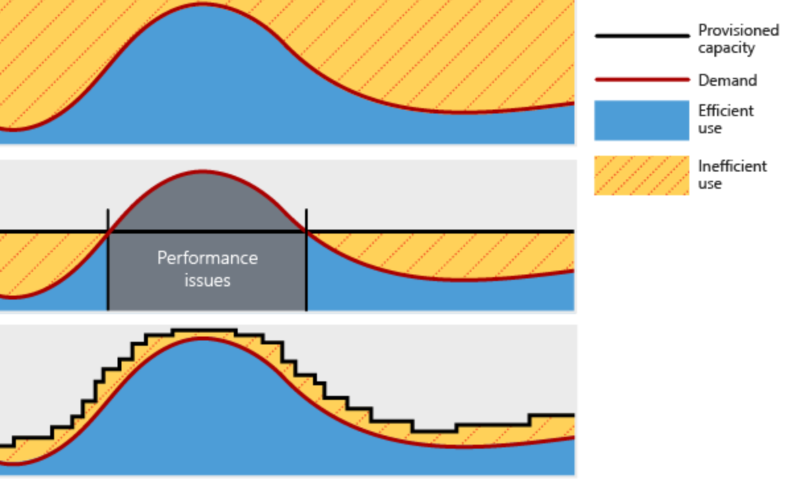

Link: https://learn.microsoft.com/en-us/training/modules/describe-core-architectural-components-of-azure/

48 minutes

# Introduction
---
* Describe Azure regions, region pairs, and sovereign regions.
* Describe Availability Zones.
* Describe Azure datacenters.
* Describe Azure resources and Resource Groups.
* Describe subscriptions.
* Describe management groups.
* Describe the hierarchy of resource groups, subscriptions, and management groups.

# What is Microsoft Azure?
---
Pronounciation - Pressure, measure, pleasure, Azure.

Microsoft Azure is a cloud computing platform and service created by Microsoft for building, deploying, and managing applications and services through Microsoft-managed data centers. It provides a wide range of cloud services, including those for compute, analytics, storage, and networking. Users can pick and choose from these services to develop and scale new applications or run existing applications in the public cloud.

NIST definition of a public cloud: A public cloud is a cloud infrastructure that is provisioned for open use by the general public. It may be owned, managed, and operated by a business, academic, or government organization, or some combination of them. It exists on the premises of the cloud provider. Elastic, scalability, and pay per usage methods.

# Get Started with Azure Accounts
---
To get started with Azure, you need to create an Azure account. You can sign up for a free account that provides you with access to a limited set of Azure services and resources. Once you have an account, you can create and manage Azure resources through the Azure portal, Azure CLI, or Azure PowerShell. You can also use Azure Resource Manager (ARM) templates to automate the deployment and management of your Azure resources. With an Azure account, you can explore the various services and features offered by Azure and start building your applications in the cloud.
Note: There are other layers, such as Management groups and Landing Zones.


Can sign up for a free account at https://azure.microsoft.com/free/ and get $200 in credit to explore Azure services for 30 days. After the free trial, you can continue using Azure with a pay-as-you-go subscription or switch to a different subscription type that suits your needs.

I have created a PAYG account for this course, and I will be using it to demonstrate various Azure services and features throughout the modules. Dupo can follow along with the labs and create screenshots and tutorials using his own Azure account.

# Exercise: Explore Azure Portal and Command Line
---
1. Sign in to the Azure portal at https://portal.azure.com/ using your Azure account credentials.
2. Familiarize yourself with the Azure portal interface, including the dashboard, navigation menu, and resource groups.
3. Open the Azure Cloud Shell by clicking on the Cloud Shell icon in the top right corner of the Azure portal. Choose either Bash or PowerShell as your preferred shell environment.
Note: You may be prompted to create a storage account for the Cloud Shell if you haven't already. Follow the prompts to set up the storage account if you wish, but it is not required for this exercise.

4. In the Cloud Shell, run the following command to list all the available Azure regions:
```powershell
az account list-locations --output table
```
Already outdated it looks like :)  
5. Explore the output to see the different Azure regions and their corresponding details, such as the region name, display name, and regional endpoint. You can also use the Azure CLI to filter the regions based on specific criteria, such as regions that support certain services or have specific features.
``` powershell
az account list-locations --query "[?metadata.regionCategory=='Recommended'].{Name:name, DisplayName:displayName, Endpoint:regionalEndpoint}" --output table
```


6. Take note of the regions that are available in your Azure subscription and their corresponding details. This information will be useful when you need to choose a region for deploying your Azure resources in future modules.
7. You can run bash commands in the PowerShell environment by prefixing the command with `bash -c`. For example, to list all available Azure regions using bash, you can run:
```powershell
bash -c "az account list-locations --output table"
```

## Az Interactive:

Note: You can't run PowerShell commands in bash, but Azure CLI commands work in both environments. You can switch between the two environments as needed to run your commands.

# Describe Azure Physical Infrastructure
---
Regions: A region is a geographical area that contains one or more datacenters. Each region is isolated from other regions to provide high availability and fault tolerance. Azure has multiple regions around the world, and you can choose the region that best suits your needs when deploying your resources.
Region Pairs: Azure regions are paired together to provide disaster recovery and high availability. Each region is paired with another region within the same geography, and they are designed to be isolated from each other to ensure that if one region experiences an outage, the other region can continue to operate without interruption.
Note: Not all services automatically replicate across region pairs. Some services require manual configuration to enable replication, while others may not support replication at all. It's important to check the documentation for each service to understand its replication capabilities and requirements.
Note: South Central US and North Central US are paired, but they are not in the same geography. They are in the same country, but they are not in the same region.

Note: West India and Brazil South are only paired in onde direction. Brazil South is paired to South Central US, but South Central US is not paired to Brazil South. This is because Brazil South is a newer region and was added after the initial region pairs were established. As a result, it was only paired with one existing region (South Central US) rather than being paired with multiple regions like the other regions in the same geography.

West India's secondary is South India, but South India's secondary is not West India. This is because South India was added as a new region after the initial region pairs were established,. South India's secondary is Central India.

Sovereign Regions: Azure also has sovereign regions that are designed to meet specific regulatory and compliance requirements. These regions are isolated from the global Azure network and are operated by Microsoft in partnership with local governments and organizations. Examples of sovereign regions include Azure Government for US government agencies and Azure China for customers in China.


Availability Zones: Availability Zones are physically separate datacenters within an Azure region. Each zone is designed to be independent and isolated from the other zones in the same region, providing high availability and fault tolerance for your applications. By deploying your resources across multiple Availability Zones, you can ensure that your applications remain available even if one zone experiences an outage.
Azure Datacenters: Azure datacenters are the physical facilities that house the servers and infrastructure that power Azure services. These datacenters are located around the world and are designed to provide high availability, security, and performance for Azure customers. Each datacenter is equipped with redundant power, cooling, and networking to ensure that your applications remain available and responsive.
Azure Resources and Resource Groups: Azure resources are the individual services and components that you can deploy and manage in Azure, such as virtual machines, databases, and storage accounts. Resource groups are logical containers that hold related Azure resources. They provide a way to manage and organize your resources based on their lifecycle, permissions, and billing. You can create resource groups to group related resources together and manage them as a single unit. This allows you to easily deploy, update, and delete resources together, and also helps you to track costs and monitor the health of your resources more effectively.
Subscriptions: An Azure subscription is a logical container that holds your Azure resources and provides a way to manage and organize them. Each subscription has its own billing and access control policies, and you can have multiple subscriptions within your Azure account. Subscriptions are used to manage access to Azure resources and to track costs and usage. You can create multiple subscriptions to separate different projects, teams, or environments, and you can also use management groups to organize your subscriptions into a hierarchy for better management and governance.
Management Groups: Management groups are a way to organize and manage multiple Azure subscriptions. They provide a way to apply policies, access controls, and compliance rules across multiple subscriptions in a hierarchical manner. You can create management groups to group related subscriptions together and manage them as a single unit. This allows you to apply policies and controls consistently across all the subscriptions in the management group, making it easier to manage and govern your Azure resources at scale.

Note: Some services are only available in certain regions. Some services are available globally, such as Entra ID, DNS, Traffic Manager. 

Note: Not all Azure regions support availability zones, those that do, there is a minimum  of 3 zones. 

## Using Availability Zones in your application
---
These are primarily used for VMs, managed disks, and load balancers. You can deploy your VMs across multiple availability zones to ensure high availability and fault tolerance. If one zone experiences an outage, the other zones can continue to operate without interruption. You can also use Azure Load Balancer to distribute traffic across multiple availability zones for better performance and reliability.

Zonal Services: Services deployed into a specific AZ.
Zone Redundant Services: Services that are automatically replicated across multiple AZs for high availability and fault tolerance. Examples include Azure SQL Database, Azure Cosmos DB, and Azure Kubernetes Service (AKS).
Non-Regional Services: Services that are not tied to a specific region or availability zone, such as Azure Active Directory and Azure DNS.


# Describe Azure Management Infrastructure
---
A resource is the main building block of Azure. It is not the smallest, but it the most basic.
Resource Group: A logical container of resources that share the same lifecycle, permissions, and policies. It is a way to group related resources together for easier management and organization.

Subscription: A logical container that holds your Azure resources and provides a way to manage and organize them. Each subscription has its own billing and access control policies, and you can have multiple subscriptions within your Azure account. Subscriptions are used to manage access to Azure resources and to track costs and usage.

- Cannot nest Resource groups. 
- Can delete the resource group to delete all resources inside of it.

Be careful when using Resource Groups as your boundary of permissions. You can create a parent subscription that holds all of your application infrastructure and then your Dev, QA, UAT and Prod environments as separate resource groups inside of the subscription. You can then apply permissions to the subscription level instead of individual resource groups. This way, you can manage access to all of the resources in the subscription more easily. You can also use management groups to organize your subscriptions into a hierarchy for better management and governance.

Note: you can also create a application management group that holds a Prod and Non Prod subscriptions and then create your resource groups respectively in those subscriptions. 

Boundaries:
Billing Boundary: Subscriptions are the billing boundary for Azure resources. Each subscription has its own billing and usage details, and you can track costs and usage at the subscription level.
Access Control Boundary: Subscriptions are also the access control boundary for Azure resources. You can assign permissions to users, groups, and applications at the subscription level, and those permissions will apply to all resources within that subscription. Resource groups can also be used to manage access control for specific resources, but permissions assigned at the subscription level will override those assigned at the resource group level.

Additional subscriptions: You can create additional subscriptions to separate different environments (e.g., Dev, QA, Prod) or to isolate different projects or teams. 
- Networking, security, identity, and governance resources should be in a separate subscription from application resources. This allows you to manage access and permissions more effectively and to ensure that critical infrastructure resources are protected from accidental changes or deletions.
- different billing subscriptions

Azure Management Groups: Management groups are a way to organize and manage multiple Azure subscriptions. They provide a way to apply policies, access controls, and compliance rules across multiple subscriptions in a hierarchical manner. You can create management groups to group related subscriptions together and manage them as a single unit. This allows you to apply policies and controls consistently across all the subscriptions in the management group, making it easier to manage and govern your Azure resources at scale.

As an administrator, you want to have that separate layer of control for multiple subscriptions. When I'm doing my work, I want the least amount of access possible to the Tenant Root Group, so I add a layer below it and a nested layer or two below that. 


- 10,000 management groups per directory.
- management can support 6 levels of nesting, but the best practice is to keep it to 3 or 4 levels for better performance and easier management.
- each management group and subscription can only have one parent. This means that a subscription can only be associated with one management group, and a management group can only be associated with one parent management group. This helps to ensure that the hierarchy of management groups and subscriptions is clear and easy to manage, and it also helps to prevent conflicts and confusion when applying policies and controls across multiple subscriptions.
# Exercise: Create your first VM
---
1. In the Azure portal, click on "Create a resource" and search for "Virtual Machine".
2. Click on "Virtual Machine" and then click on "Create".
3. Fill in the required fields for your virtual machine, such as the subscription, resource group, virtual machine name, region, and image. You can also choose the size of the virtual machine and configure other settings such as networking, storage, and security.
4. Once you have filled in all the required fields, click on "Review + create" to review your settings and then click on "Create" to create your virtual machine.
5. After the deployment is complete, you can access your virtual machine by clicking on the "Go to resource" button. You can also connect to your virtual machine using Remote Desktop Protocol (RDP) or Secure Shell (SSH) depending on the operating system you chose for your virtual machine. You can find the connection details in the "Overview" section of your virtual machine resource in the Azure portal.
Note the hierarchy of the resources you created. You have a subscription, a resource group, and a virtual machine. You can also see the region where your virtual machine is deployed. This hierarchy helps you to manage and organize your Azure resources effectively.

Take a moment and destroy this vm and then practice building out a deeper hierarchy with a couple nested resource groups and a couple VMs in each resource group. This will help you to understand how to manage and organize your Azure resources effectively using resource groups and subscriptions.
Reminder: Delete when completed to avoid unnecessary costs.