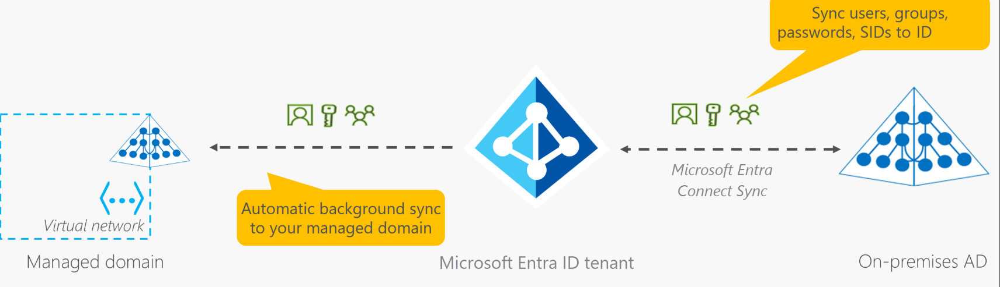
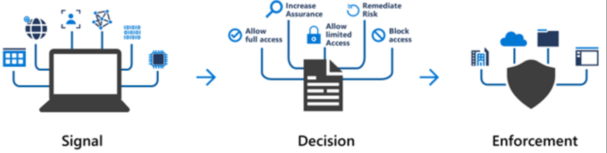
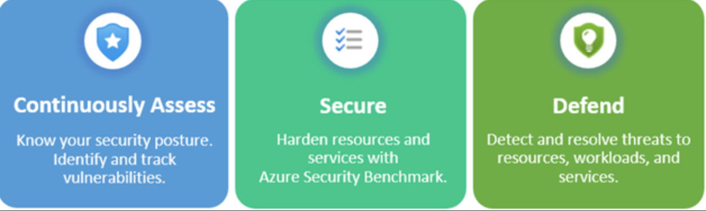

# Link
---
https://learn.microsoft.com/en-us/training/modules/describe-azure-identity-access-security/

43 minutes

# Introduction
---
* Describe directory services in Azure, including Microsoft Entra ID and Microsoft Entra Domain Services.
* Describe authentication methods in Azure, including single sign-on (SSO), multifactor authentication (MFA), and passwordless.
* Describe external identities and guest access in Azure.
* Describe Microsoft Entra Conditional Access.
* Describe Azure Role Based Access Control (RBAC).
* Describe the concept of Zero Trust.
* Describe the purpose of the defense in depth model.
* Describe the purpose of Microsoft Defender for Cloud.

# Describe Azure Directory Services
---
Entra ID is a cloud-based identity and access management service that provides authentication and authorization for applications and services in Azure. It allows you to manage users, groups, and devices, and provides features such as single sign-on (SSO), multifactor authentication (MFA), and passwordless authentication.

Entra ID is for:
- IT administrators who need to manage user identities and access to resources in Azure.
- App Developers who need to integrate authentication and authorization into their applications.
- Users - password reset, self-service group management, and access to applications.
- Online Services - Microsoft 365, Azure, and other SaaS applications.

WHat does Entra ID do?
- Authentication: Verifies the identity of users and applications trying to access resources in Azure.
- Single Sign-On (SSO): Allows users to sign in once and access multiple applications without needing to sign in again.
- Application Management: Provides a central location for managing access to applications and services in Azure.
- Device Management: Allows you to manage and secure devices that access Azure resources. Intune :)

You can connect your on prem Active Directory to Entra ID using Azure AD Connect, which allows you to synchronize your on prem identities to the cloud and provide a seamless sign-in experience for users.

## Entra Domain Services
---
Entra Domain Services is a managed domain service that provides domain join, group policy, and LDAP/NTLM authentication capabilities without the need for on prem domain controllers. It allows you to use your existing Entra ID identities to access resources in Azure without the need for additional infrastructure.

This allows you to lift and shift applications that require domain services to Azure without needing to manage domain controllers in the cloud. It also provides a way to use legacy applications that require domain services without needing to refactor them for the cloud.

How does it work?
- You create an Entra Domain Services managed domain in Azure.
- You synchronize your Entra ID identities to the managed domain.
- You can then join your virtual machines to the managed domain and use group policy to manage them. You can also use LDAP/NTLM authentication to access resources in the managed domain.
- Two domain controllers are created in the managed domain for high availability and redundancy. You can also create additional domain controllers if needed.
- 

# Describe Azure Authentication Methods
---
Azure supports several authentication methods to secure access to resources in the cloud. These include:
- Single Sign-On (SSO): Allows users to sign in once and access multiple applications without needing to sign in again. This can be achieved using Entra ID and is supported by many applications and services in Azure.
- Multifactor Authentication (MFA): Requires users to provide additional verification beyond just a password, such as a phone number or biometric factor. This can be enabled for users in Entra ID to provide an extra layer of security for accessing Azure resources.
- Passwordless Authentication: Allows users to sign in without using a password, instead using methods such as biometrics or a security key. This can be enabled for users in Entra ID to provide a more secure and convenient authentication experience.

Authentication: Process of verifying the identity of a user or identity.
With SSO, you just need one ID and one password. 
With MFA, you need two or more pieces of evidence to verify your identity.

Note: Single Sign On is only as secure as the intial authentication method. If you have weak passwords, then SSO can be a security risk. MFA can help mitigate this risk by requiring additional verification.

## Multifactor Authentication (MFA)
---
MFA is the process of prompting a user for an extra piece of information beyond just a password. 
Limit the impact of credential exposure. My username and password can be compromised, but if the hacker has my username and password, but they'll just be prompted for a second factor, which they won't have access to. Their hack is useless.

This can be something:
- they know (like a password)
- something they have (like a phone or security key)
- or something they are (like a biometric factor)

MFA can be a burden sometimes. That extra overhead, what if I lose my phone or my device type scenario. 

Passwordless authentication can be a great alternative to MFA, as it eliminates the need for passwords altogether and relies on more secure methods of authentication, such as biometrics or security keys. This can provide a more seamless and secure authentication experience for users while still protecting access to Azure resources.

## Passwordless Authentication
---
Passwordless authentication allows users to sign in without using a password, instead using methods such as biometrics or a security key. This can provide a more secure and convenient authentication experience for users while still protecting access to Azure resources.

Basically your device becomes you. IPhone with Face ID or your laptop with Windows Hello. You can also use a security key, which is a physical device that you can use to authenticate. This can be a great option for users who don't want to use passwords or who have difficulty remembering them.

### Windows Hello for Business
---
Windows Hello for Business is a passwordless authentication method that allows users to sign in to their Windows devices using biometric factors such as facial recognition or fingerprint scanning. It provides a more secure and convenient way for users to access their devices and Azure resources without the need for passwords. This is used to seamelessly access corporate resources and in the cloud.

### Microsoft Authenticator App
---
The Microsoft Authenticator app is a mobile application that provides an additional layer of security for user authentication. It can be used for multifactor authentication (MFA) and passwordless authentication. The app generates time-based one-time passwords (TOTPs) that users can use to verify their identity when signing in to Azure resources. It also supports push notifications for MFA, allowing users to approve or deny sign-in attempts directly from their mobile device.

You download the app, connect it to your identity and it sends you OTP numbers or prompts through the app.

### FIDO2 Security Keys
---
Fast IDentity Online Alliance (FIDO) is an open standard for passwordless authentication. FIDO2 security keys are physical devices that provide a secure and convenient way for users to authenticate without using passwords. They are based on the FIDO2 standard, which allows for passwordless authentication using public key cryptography. Users can use these security keys to sign in to Azure resources by simply inserting the key into a USB port or tapping it on a compatible device. This provides a strong level of security while eliminating the need for passwords.

This is a physical device or a hardware security key built into a device. 
- Can be USB, Bluetooth, or NFC.
- Provides a secure and convenient way for users to authenticate without using passwords.

Security is increased as there is no password to steal, and the authentication process is based on public key cryptography, which is resistant to phishing attacks and other common password-based attacks.

# Describe Azure External Identities
---
An external identity is a user or group that is not part of your organization's directory but needs access to your Azure resources. Azure provides several options for managing external identities, including:
- Azure AD B2B (Business-to-Business): Allows you to invite external users to collaborate on your Azure resources using their existing credentials from their own organization.
- Azure AD B2C (Business-to-Consumer): Allows you to create a custom identity experience for your customers, enabling them to sign up and sign in using their social media accounts or email addresses.
- Azure AD External Identities: Provides a way to manage external identities and their access to your Azure resources, allowing you to control who can access your resources and what they can do with them.
TLDR:
- B2B = External users from other organizations with their own identity provider
- B2C = Publish apps to consumers using Entra ID B2C for authentication
- B2B direct connect: Establish a trust relationship between two Entra ID tenants, allowing users from one tenant to access resources in another tenant without needing to create separate accounts.


# Describe Azure Conditional Access
---
Azure Conditional Access is a policy-based access control mechanism that allows you to enforce specific conditions for accessing Azure resources. It provides a way to control access to your resources based on various conditions, such as user location, device state, risk level, and more. With Conditional Access, you can create policies that require users to meet certain criteria before they can access your resources, such as requiring MFA for users accessing from an untrusted location or blocking access for users with high-risk sign-in behavior. This helps to enhance the security of your Azure resources by ensuring that only authorized users can access them under specific conditions.

This helps allowing or denying access a bit more granularly. 
During sign in, Azure evaluates the conditions of the access request and applies the appropriate policies to determine whether to allow or deny access. This can include requiring MFA, blocking access from certain locations, or enforcing device compliance policies.



Signal, decision, enforcement.

When to use Conditional Access:
- When you want to enforce specific conditions for accessing Azure resources.
- When you need to require MFA for certain users or under certain conditions.
- When you want to block access for users with high-risk sign-in behavior.
- When you want to restrict access based on user location or device state.
- Blocking access from untrusted sources
- Access only from a hybrid joined or managed device.

# Azure Role Based Access Control (RBAC)
---
Azure Role-Based Access Control (RBAC) is a system that allows you to manage access to Azure resources by assigning roles to users, groups, or applications. RBAC provides a way to control who can access your Azure resources and what they can do with them. With RBAC, you can create custom roles or use built-in roles to grant specific permissions to users or groups, such as read-only access, contributor access, or owner access. This helps to ensure that users only have the necessary permissions to perform their tasks while maintaining the security of your Azure resources.
- RBAC allows you to manage access to Azure resources by assigning roles to users, groups, or applications. 
- RBAC provides a way to control who can access your Azure resources and what they can do with them. 
- With RBAC, you can create custom roles or use built-in roles to grant specific permissions to users or groups, such as read-only access, contributor access, or owner access.

This is an allow model, not a deny model. You can only grant permissions, you cannot explicitly deny permissions. If a user is not granted access to a resource, they will be denied access by default.

Principle of least privilege: If you need access to a resource, only give them the permissions they need to do their job and nothing more. This helps to minimize the risk of accidental or intentional misuse of resources.
- Built-in roles: Owner, Contributor, Reader, User Access Administrator, etc.
- Custom roles: You can create custom roles with specific permissions to meet your organization's needs.
- Role assignments: You can assign roles to users, groups, or applications at different scopes, such as subscription, resource group, or individual resources.
- Role inheritance: Permissions assigned at a higher scope (e.g., subscription) are inherited by lower scopes (e.g., resource groups and resources) unless explicitly overridden.

How these are applied: You put the user in a group and give the group permissions. Then, when new users come along with similar roles, you just add them to the group.

Application Levels:
Scopes can be applied at different levels, such as:
- Tenant level: Permissions apply to all resources in the tenant.
- Management group level: Permissions apply to all resources in the management group and its child resources.
- Subscription level: Permissions apply to all resources in the subscription.
- Resource group level: Permissions apply to all resources in the resource group.
- Resource level: Permissions apply to a specific resource.
- Role assignments can be made at any of these levels, and permissions will be inherited down the hierarchy unless explicitly overridden.

Note: Remember that these are Azure permissions and these are different than Entra ID permissions. Entra ID permissions are for managing identities and access to Azure resources, while Azure RBAC permissions are for managing access to Azure resources themselves.

Example: Owner at the management group level has permissions to all resources that roll up to that management group.
Example2: Owner at the resource level will not have permissions to any other resources in the same resource group or subscription, only that specific resource.

Enforcement: RBAC is enforced by Azure Resource Manager (ARM) when a user tries to access a resource. ARM checks the user's role assignments and permissions to determine if they have the necessary access to perform the requested action on the resource. If the user does not have the required permissions, access will be denied.

Note: RBAC does not enforce access permissions at the application level. Your Application must have its own security model.

JSON example of a custom role definition:
```json
{
  "Name": "Custom Role Name",
  "Description": "Description of the custom role",
  "Actions": [
    "Microsoft.Compute/virtualMachines/start/action",
    "Microsoft.Compute/virtualMachines/read"
  ],
  "NotActions": [],
  "AssignableScopes": [
    "/subscriptions/{subscription-id}"
  ]
}
```
In this example, the custom role allows users to start virtual machines and read their properties, but does not allow any other actions. The role can be assigned to users or groups at the subscription level, meaning it will apply to all resources within that subscription.

# Describe the concept of Zero Trust
---
Zero Trust is a security model that assumes that all users, devices, and applications are untrusted by default, and requires continuous verification of their identity and access permissions before granting access to resources. The Zero Trust model is based on the principle of "never trust, always verify," which means that access to resources is granted only after verifying the identity and access permissions of the user or device requesting access. This approach helps to reduce the risk of unauthorized access and data breaches by ensuring that only authorized users and devices can access sensitive resources.
- Verify explicitly: Always authenticate and authorize based on all available data points, including user identity, location, device health, service or workload, data classification, and anomalies.
- Use least privileged access: Limit user access with just-in-time and just-enough-access (JIT/JEA), risk-based adaptive policies, and data protection to protect both data and productivity.
- Assume breach: Minimize blast radius for breaches and prevent lateral movement by segmenting access by network, user, devices, and app awareness. Verify all sessions are encrypted end to end. Use analytics to get visibility, drive threat detection, and improve defenses.

Don't assume that a device or user is trustworthy just because they are inside the network perimeter. Always verify their identity and access permissions before granting access to resources.

Grant access based on authentication rather than location in the network. This means that even if a user is on the corporate network, they should still be required to authenticate and be authorized before accessing resources.

# Describe the purpose of the defense in depth model
---
Defense in depth is a security strategy that involves implementing multiple layers of security controls to protect against different types of threats. The idea is that if one layer of defense is breached, there are additional layers in place to prevent or mitigate the attack. This approach helps to reduce the risk of a successful attack and provides a more comprehensive security posture for your Azure resources.

Kind of like the OSI model, but for security. You have multiple layers of security controls that work together to protect your resources. This can include things like network security, identity and access management, data protection, and threat detection.

Here's a brief overview of the role of each layer:

* The physical security layer is the first line of defense to protect computing hardware in the datacenter.
* The identity and access layer controls access to infrastructure and change control.
* The perimeter layer uses distributed denial of service (DDoS) protection to filter large-scale attacks before they can cause a denial of service for users.
* The network layer limits communication between resources through segmentation and access controls.
* The compute layer secures access to virtual machines.
* The application layer helps ensure that applications are secure and free of security vulnerabilities.
* The data layer controls access to business and customer data that you need to protect.

Physical Security: Protects the physical infrastructure of the datacenter, including servers, storage, and networking equipment. This can include measures such as access controls, surveillance, and environmental controls.

Identity and Access Management: Controls access to Azure resources by managing user identities, roles, and permissions. This can include features such as Azure Active Directory, role-based access control (RBAC), and multi-factor authentication (MFA).

Perimeter Security: Protects the network boundary from external threats. This can include measures such as firewalls, intrusion detection and prevention systems (IDPS), and virtual private networks (VPNs).

Network Security: Protects the internal network from threats and limits communication between resources. This can include measures such as network segmentation, access controls, and monitoring.

Compute Security: Protects virtual machines and other compute resources from threats. This can include measures such as host-based firewalls, antivirus software, and security patches. Endpoint protection is also a must here. 

Application Security: Protects applications from threats and vulnerabilities. This can include measures such as secure coding practices, application firewalls, and vulnerability assessments. Static code analysis and static application security testing (SAST) can also be used to identify and remediate vulnerabilities in applications.

Data Security: Protects sensitive data from unauthorized access and breaches. This can include measures such as encryption, data masking, and access controls.
- Attackers are interest in data that is stored in a database, on a vm, in Saas applications, or in storage accounts. You need to protect this data with encryption, access controls, and monitoring.

# Microsoft Defender for Cloud
---
Microsoft Defender for Cloud is a comprehensive security management solution that provides advanced threat protection for Azure resources.

Gives you protection everywhere you are deployed, whether it's in Azure, on-premises, or in other clouds. It provides a unified view of your security posture across all your resources and helps you to identify and mitigate potential threats.

Azure Native Protections:
- Azure PaaS services - Defender for App Service, Cloud Apps
- Azure IaaS services - Defender for Virtual Machines, Defender for Kubernetes, etc.
- Azure Data services - Defender for SQL, Defender for Cosmos DB, etc.
- Networks - Assists with defending against threats to your network resources, brute force attacks, DDoS attacks, etc.

Hybrid Protections:
- On-premises servers and VMs - Defender for Servers via Azure Arc

Other Clouds:
- AWS and GCP resources - Defender for Cloud can monitor and protect resources in other clouds.
- Provides a unified view of your security posture across all your resources, regardless of where they are deployed.
- Defender for Containers extends protection to containerized workloads running in any environment, including on-premises and other clouds.
- Defender for Servers brings threat detection and security management to your on-premises and multi-cloud servers through Azure Arc.

## Access, Secure, Defend.
---

Continually Assess - Know your security posture
Secure - Harden Resources with Azure Security Benchmark
Defend - Detect and respond to threats, workloads and services



Continually assess - Get continuous security assessments and actionable recommendations to help you strengthen your security posture. Defender for cloud includes vulnerability assessments, adaptive application controls, just-in-time VM access, and more.

Microsoft Defender for servers includes integration into Defender for Endpoint, which provides advanced threat detection and response capabilities for your servers.

Secure - Implement security best practices and harden your resources with built-in security controls and policies based on the Azure Security Benchmark. This includes network segmentation, access controls, and data protection.
Zero trust principles are built into the recommendations and policies provided by Defender for Cloud.

Built on top of Azure Policy, so you can create custom policies and initiatives to meet your organization's specific security requirements.

You can view your security score in Azure Advisor or Security Center. 

Defend - Security alerts and threat detection capabilities help you to identify and respond to potential threats in real-time. This includes behavioral analytics, machine learning, and threat intelligence to detect and respond to threats across your Azure resources.

Advanced threat detection for vms, sql databases, storage accounts, and more. Uses behavioral analytics and machine learning to identify potential threats and provide actionable recommendations for remediation. Just in time vm access is also important here.


