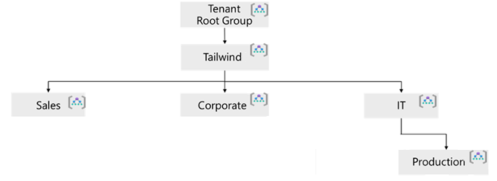
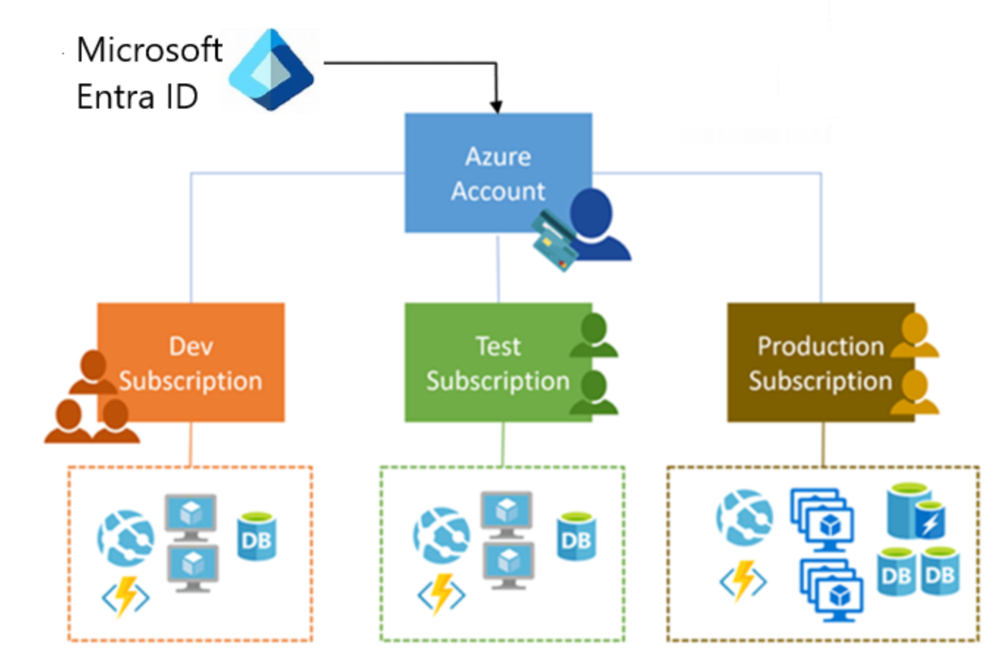
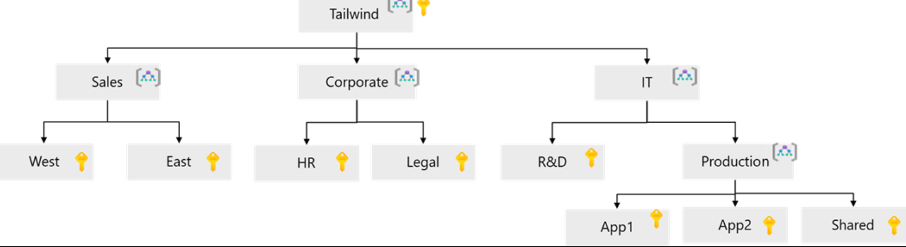
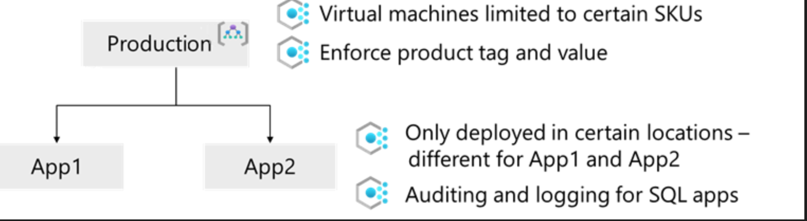

# Link: 
---
https://learn.microsoft.com/en-us/training/modules/design-governance/

49 minutes

# Introduction
---
*   Design for governance.
*   Design for management groups.
*   Design for Azure subscriptions.
*   Design for resource groups.
*   Design for resource tagging.    
*   Design for Azure Policy.
*   Design for Azure role-based access control.
*   Design for Azure landing zones.

Governance means that you establish rules and policies and then enforce those rules and policies.

For this course, Microsoft gives us a fictional company called Tailwind Traders. They want you to act like their CTO and help them design governance for their Azure environment.

# Design for governance
---
Design your hierarchical structure to support your organization's governance requirements.
- Management Groups through Resource hierarchy
- Azure Policies
- Resource Tagging

## Hierarchy
---
* Management Groups - help you manage access, policy, and compliance across multiple Azure subscriptions.
* Subscriptions - logical containers used for management and scale, and billing boundaries.
* Resource Groups - logical containers that hold related resources for an Azure solution.
* Resources - individual services and components within a resource group.

Note: The tenant root group contains ALL management groups and subscriptions in the tenant.

# Design for management groups
---
- Limit the regions where resources can be deployed.
- Enforce naming conventions for resources.
- Apply tags to resources for cost tracking.
- Provide user access to multiple subscriptions by providing a role assignment at the management group level that is inherited by all subscriptions within the management group.
- Monitor and audit role and policy assignment, across subscriptions, from a single location.

Things to consider:
- Management Groups can be used to aggregate policy and initiative assignments via Azure Policy
- Six levels od depth are allowed in the management group hierarchy, not including the root or subscription level.
- RBAC for management groups isn't enabled by default.
- All new subscriptions are automatically placed in the root management group unless moved.

# Tailwind Traders Proposed Hierarchy
---

* Design management groups with governance in mind.
* Keep the management group pretty flat. Too many levels can make it hard to manage at first.
* Consider a top level management group.
* Organizational or departmental structure. Sales, Marketing, IT, HR, Finance.
* Consider a production management group and subscriptions.
* Sandbox or development management group and subscriptions.
* Isolate sensitive workloads in their own management group and subscriptions.

# Design for Subscriptions
---

* Use subscriptions to manage costs, security, and compliance.
* Use subscriptions to separate environments, such as development, testing, and production.
* Policies for different subscriptions can satisfy different compliance requirements.
* Use subscriptions to isolate workloads with different security requirements.
* Organize specialized workloads beyond subscription boundaries.
* Use subscriptions to manage resource limits and quotas.
* Use subscriptions for billing and cost management boundaries. 

## Considerations
---

- Treat subscriptions as a democratized unit of management.
- Group subscriptions together by management group - policy inheritance model. 
- Consider a dedicated shared services subscription for common services., security, networking.
- Watch out for subscription limits and quotas.
- Administrative management. Could the Corporate management group have HR and Legal subscriptions?
- Consider how to assign Azure policies. - PCI or HIPAA compliance.
- Consider network topology. VNet peering, VPN Gateway, ExpressRoute.
- Consider making subscription owners aware of their roles and responsibilities. 

Note: Explore your options with subscriptions. There is no one-size-fits-all approach.

# Design for Resource Groups
---
Resource Groups are logical containers that hold related resources for an Azure solution.
* Group resources that share the same lifecycle.
* Apply role-based access control at the resource group level.
* Apply tags at the resource group level.
* Apply Azure Policy at the resource group level.
* Consider resource group limits. A subscription can contain up to 980 resource groups.
* Use resource group locks to prevent accidental deletion or modification of critical resources.
* Organize resources by lifecycle so that resources can be deployed and deleted at the same time.

Things to know about Resource Groups:
* Resources can only exist in one resource group.
* Resources can be moved between resource groups.
* The region of a resource group is independent of the resources it contains.
* Resources can be in different regions within the same resource group.
* Resources can connect across resource groups.
* Resource groups cannot be nested. 
* Resource Groups cannot be renamed.

You can sort resources groups by type or application or use case, billing or location. 
Combinations of organizational strategies can also be used.

Resource lifecycle example:
- A web application might have a resource group for the front-end web servers, another for the back-end databases, and another for networking components. When the application is decommissioned, all related resource groups can be deleted together.
- Tag with lifecycle information such as "Environment: Production" or "Project: Alpha".

Speaking of tagging...

# Design for Resource Tagging
---
Resource tags are name-value pairs that enable you to categorize resources.
Tip: Ask yourself what the purpose of tagging is for your organization before implementing a tagging strategy.
* Use tags to organize resources for cost management and billing.
* Use tags to identify resources by environment, department, project, or owner.
* Use tags to track resource lifecycle, such as creation date or expiration date.
* Use tags to support automation and scripting.
* Enforce tagging policies using Azure Policy.
* Consider a consistent naming convention for tags.
* Avoid over-tagging, which can lead to complexity and confusion.
* You can apply tags at the resource, resource group, or subscription level.
* You can apply up to 50 tags per resource.
* If tags are applied at the resource group, you need to build a way to inherit those tags to the resources within that resource group.

Note: Organizations are changing to a business aligned tagging strategy. Tags that reflect business units, cost centers, projects, and environments are more useful for governance and cost management.

## Tag types:
---
* Functional Tags - Identify the purpose or function of a resource. Example: "Environment: Production", "Department: Finance".
* Classification Tags - Indicate the sensitivity or criticality of a resource. Example: "Confidentiality: High", "Compliance: PCI-DSS". SLA = 24hours
* AccountingTags - Used for cost allocation and tracking. Example: "CostCenter: 12345", "Project: Alpha", Department: Marketing".
* Partnership Tags - Identify resources related to specific vendors or partners. Example: "Vendor: Contoso", "Partner: ABC Corp", Owner: Solomon".
* Purpose Tags - Describe the intended use or purpose of a resource. Example: "Purpose: WebApp", "Purpose: Database", "Purpose: Backup", RevenueImpact: High".

Note: Start with a few tags and then scale out. Determine how effective your tagging strategy is.
Note: Considuer using Azure Policy to enforce tagging rules and ensure compliance across your resources.
Maybe tag some resources and not all: Mission Critical gets a tag, others do not. 

# Design for Azure Policy
---
Azure Policy helps enforce organizational standards and assess compliance at-scale.
* Azure Policy lets you define individual policies or group them into initiatives.
* Azure Policies are inherited down the resource hierarchy.
* You can scope and enforce Azure Policies at different levels: management group, subscription, resource group, or individual resource.
* Use Azure Policy to enforce tagging rules and ensure resources are tagged correctly.
* Azure Policy evaluates ALL resources for compliance and highlights non-compliant resources.
* Integrates with Azure Pipelines for applying pre and post-deployment policies

Things to consider:
* Azure Policy compliance dashboard. 
* Understand when Azure Policy evaluates resources for compliance.
  * A resource is created or updated or deleted
  * Policy is newly assigned to a scope
  * Policy or initiative definition is updated
  * Standard evaluation interval (typically every 24 hours)
* Consider how to handle a non-compliant resource. Remediation tasks can be created to bring resources into compliance.
  * Deny the resource creation or update
  * Log chnages
  * Alter the resource
  * Deploy related compliant resources
* Consider when to automatically remediate non-compliant resources.
  * Resource Tagging
  * Can tag and reapply tags
* Consider how Azure Policy is different from RBAC.
  * Azure Policy shouldn't care who made the change, just that the resource adheres to policy.
  * RBAC cares about who can make changes to resources. Consider using RBAC to limit who can make changes that would violate policy.

## Control Resource Access
---
The last point is hugely important. You need to control who can make changes to resources in your environment.
If you uses IaC to provision resources, why are you letting people make changes outside of that process?

Design for Role-Based Access Control (RBAC)

