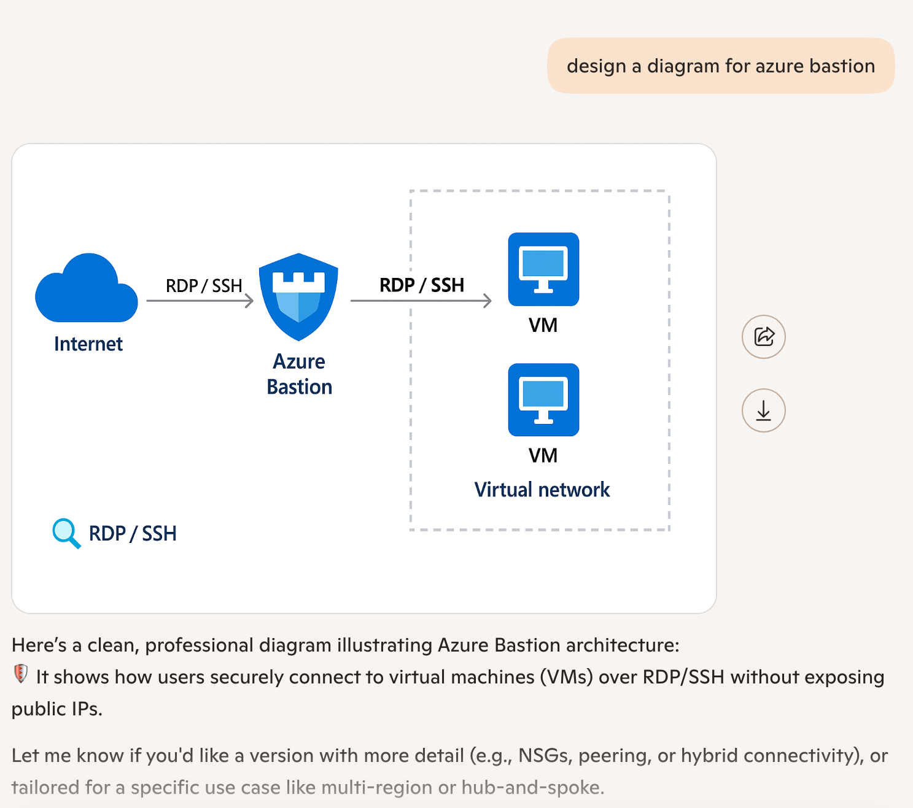
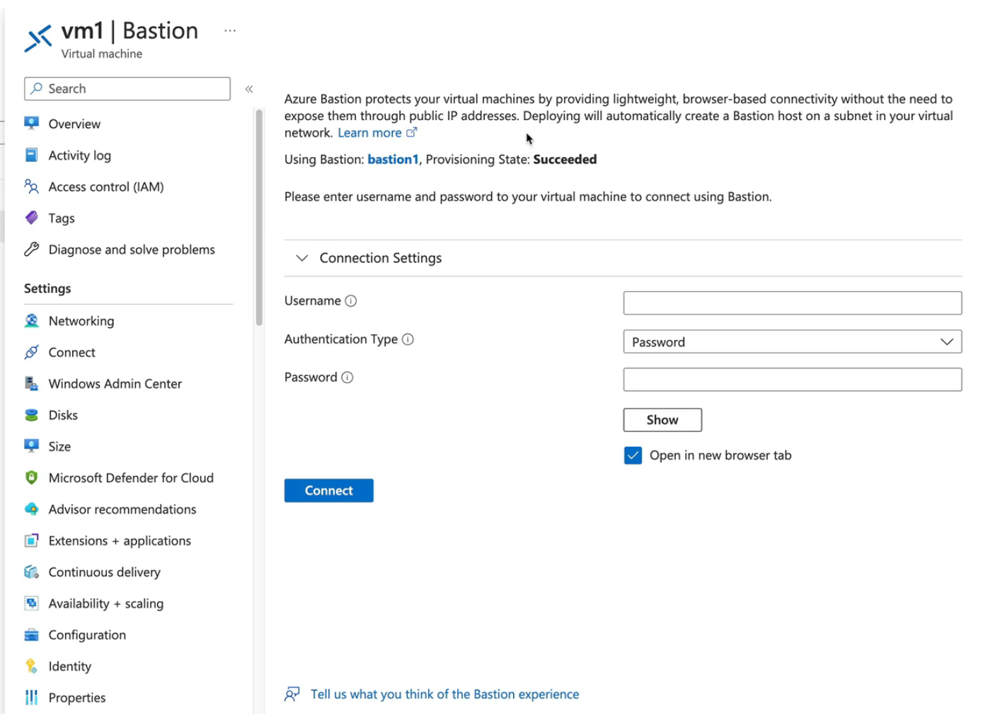
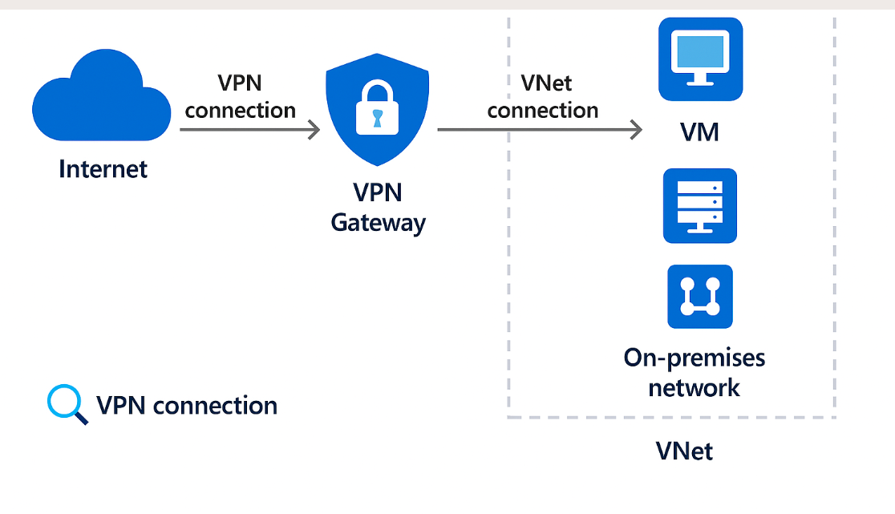
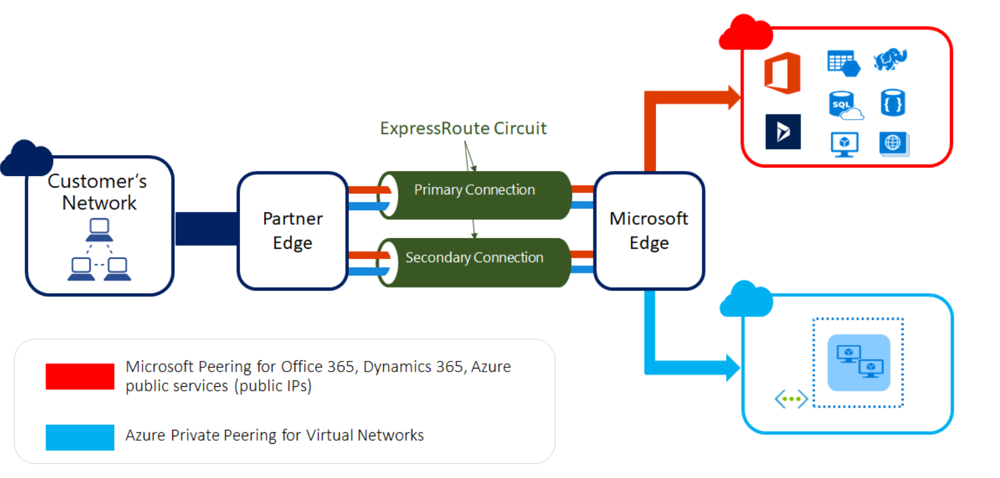
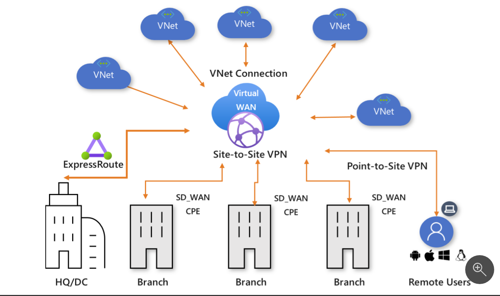
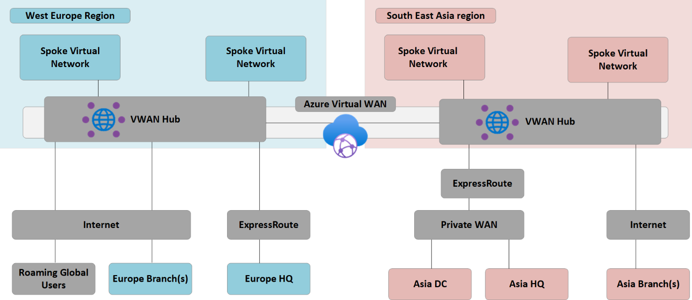

# Web Application Firewalls
---
- Protects from **OWASP** threats (**SQL injection**, **XSS**)
- Geographic filtering
- **bot protection**
- rate limiting

## Components
---
- **WAF Policy**
- Settings
- Association - **Front Door** (global) or **App Gateway** (regional)

Can apply at a path level or backend

# Demo - Configure a global WAF
---
1. Create some type of load balancer
2. Create a **WAF** policy
- not global or regional from the notes above
3. Select global and select the **Front Door** tier
4. Create a new RG and then set the policy mode (prevention or detection)
5. You don't get access to managed rules with the **Standard** SKU
6. Check through these and make sure you are getting the service that you want to have. You can upgrade to certain SKUs to match what you need for the **WAF policy**. 

# VNet Peering
---
Connecting one **VNet** to another **VNet**

## Components
---
Hub and **spoke** topology:

Routes - automatically updated to allow connectivity. 

NOTE: There is no **transitive routing** (red line) by default. 

NOTE: Cannot peer overlapping IP ranges
NOTE: Peering works across regions/tenants

# Demo - Configure VNet Peering
---
1. Set up two non overlapping IP range **VNets** and **VMs**: Quick Deploy: https://portal.azure.com/#create/Microsoft.Template/uri/https%3A%2F%2Fraw.githubusercontent.com%2Fjamesdplee%2Fcloudlee-click2deploy%2Fmain%2Ftemplates%2Fvm-generic.json
2. Peer the **VNets**
  - Check the settings and reference the correct settings when building your peering
  - you can enter in the resource ID from a subscription that we don't have access to
3. Finish peering the **VNets**

4. Log into one of the **VMs** and try to connect to the other via the private IP
- **NSG** may be blocking traffic, watch out for this. 

# Service Endpoints
---

Some services are public services, **SQL**, **Web Apps**, for example. 

**VNets** are private. A resource in the **VNet** needs to talk externally via a public IP address to a public endpoint to a public service....unless we use **Service Endpoints**.

**Service Endpoints** allow for traffic across the Microsoft Backbone

## Components
---
- **Subnet**
- **Service Endpoint**
- Routes

# Demo - Configure a Service Endpoint for Azure Files
---
1. Deploy these resources: https://portal.azure.com/#create/Microsoft.Template/uri/https%3A%2F%2Fraw.githubusercontent.com%2Fjamesdplee%2Fcloudlee-click2deploy%2Fmain%2Ftemplates%2Fvm-generic.json
2. On the **subnet**, configure the **service endpoint**

3. Test the connectivity between the **VMs**

# Private Link
---
This is like the **Service Endpoints**, but....extending them into our network.

## Components
---
- **Private Endpoint** - The network interface that is deployed to a subnet within a **VNet**. 
- Resource - the target resource - can be a different region
- **IP Address** - this is on our local **VNet**
- **DNS Integration** - a **Private DNS** zone will use the private IP addressing. 

## Private Link Service
---
Connecting to an external Azure resource outside of your tenant. 

## Demo - Configuring a Private Endpoint
---
1. Deploy this: https://portal.azure.com/#create/Microsoft.Template/uri/https%3A%2F%2Fraw.githubusercontent.com%2Fjamesdplee%2Fcloudlee-click2deploy%2Fmain%2Ftemplates%2Fvm-generic.json
2. Create a storage account and upload a few basic files into a file share. 
3. **Private Link Center** is a fun way to manage these resources
4. Click Create, give it the RG, name the **PE** and the nic
5. Place this in the same region that the **VNet** lives. 
6. Select the resource type and then the target sub-resource 
7. Place this into your **VNet** with a static **IP**
8. Integrate with **Private DNS**
9. Tag the resources
10. Deploy. 

## Connect to the VM
---
1. Navigate into the file share and click Connect
2. Grab the script and copy it and then run it in Powershell in the **VM**
3. Do a **nslookup** on the DNS entry and it will return an IP on your **VNet**
4. The public endpoint will still be the same outside of the private **VNet**
5. Try to connect to the file share using the private **IP** address and it should work.

# Azure Bastion
---
Azure Bastion is a fully managed **PaaS** service that provides secure and seamless **RDP** and **SSH** connectivity to your **VMs** directly through the **Azure portal**. It eliminates the need for exposing your VMs to the public internet, thus enhancing security by providing a secure and private connection to your VMs without the need for a jump box or public IP addresses. Azure Bastion is deployed within your virtual network and provides a secure gateway for remote access to your VMs, allowing you to connect to them securely from anywhere in the world using the Azure portal. It supports both **RDP** and **SSH** protocols, and it provides features such as **multi-factor authentication**, **role-based access control**, and **session recording** for enhanced security and auditing. With Azure Bastion, you can securely manage your VMs without the need for additional infrastructure or complex network configurations, making it an ideal solution for secure remote access to your Azure virtual machines.

## System Administration
---
- Azure Bastion provides a secure and seamless way to manage your virtual machines (**VMs**) without exposing them to the public internet. It allows you to connect to your VMs using **RDP** or **SSH** directly from the **Azure portal**, eliminating the need for a jump box or public IP addresses.
- To use Azure Bastion, you need to deploy it within your virtual network. Once deployed, you can connect to your VMs securely from anywhere in the world using the Azure portal. Azure Bastion supports both **RDP** and **SSH** protocols, and it provides features such as **multi-factor authentication**, **role-based access control**, and **session recording** for enhanced security and auditing.
- Don't use **RDP 3389** or **SSH 22** for your VMs, as these ports are commonly targeted by attackers. Instead, use Azure Bastion to securely connect to your VMs without exposing them to the public internet. This helps to reduce the attack surface and enhance the security of your virtual machines.
- This does need a subnet with a specific name and size, so make sure to follow the documentation when deploying Azure Bastion. The subnet must be named "**AzureBastionSubnet**" and must be at least /27 in size to accommodate the required number of IP addresses for the Bastion service.
- You connect to this via public IP address, but the connection is made securely through the **Azure portal**. This means that you can manage your VMs without exposing them to the public internet, providing an additional layer of security for your virtual machines.

Note: difference between basic and standard SKU is that the standard SKU provides additional features such as support for multiple VMs, enhanced security features, and more granular access control. The basic SKU is suitable for small-scale deployments or testing purposes, while the standard SKU is recommended for production environments or larger deployments that require advanced features and scalability.
- native support
- cannot downgrade to basic SKU once you have standard SKU deployed.

# Demo - Configure Azure Bastion
---
1. Configure a **VNet** and a **VM** in that **VNet**
2. Create a subnet named "**AzureBastionSubnet**" with a /27 address space
3. Create an Azure Bastion resource in the same region as your **VNet**
4. Configure the Azure Bastion resource to use the "**AzureBastionSubnet**" and associate it with your **VNet**
5. Once the Azure Bastion resource is deployed, navigate to your **VM** in the **Azure portal** and click on "Connect"
6. Select "Bastion" as the connection method and click "Use Bastion"
7. Enter your credentials and click "Connect"
8. You should now be connected to your **VM** securely through Azure Bastion without exposing it to the public internet. You can manage your **VM** as needed, and all traffic will be securely routed through the Azure Bastion service, providing an additional layer of security for your virtual machine.
9. To disconnect from the **VM**, simply close the browser tab or click on the "Disconnect" button in the **Azure portal**. This will terminate the Bastion session and ensure that your **VM** remains secure.

# VPN Gateway
---
A **VPN gateway** is a type of **virtual network gateway** that provides secure connectivity between an **Azure virtual network** and an on-premises network or another virtual network. It allows you to create a secure connection over the public internet using industry-standard protocols such as **IPSec** and **IKE**. A VPN gateway can be used to connect your Azure virtual network to an on-premises network, allowing you to extend your on-premises network into Azure and access resources in the virtual network as if they were on your local network. It can also be used to connect multiple virtual networks together, enabling communication between them without the need for a public internet connection. VPN gateways are commonly used for hybrid cloud scenarios, where you want to integrate your on-premises infrastructure with Azure, or for securely connecting multiple virtual networks together in Azure.

This allows you to configure a **Site-to-Site VPN** connection. This is a virtual private network connection that is set for **VPN Gateway**. The other option is **ExpressRoute**, which is a private connection that does not go over the public internet.
This uses **IPSec** and **IKE** protocols to tunnel traffic securely between the on-premises network and the Azure virtual network. The VPN gateway can be configured to support multiple connections, allowing you to connect multiple on-premises networks or virtual networks together.

Note: this does need a Gateway subnet with a specific name and size, so make sure to follow the documentation when deploying a **VPN gateway**. The subnet must be named "**GatewaySubnet**" and must be at least /27 in size to accommodate the required number of IP addresses for the VPN gateway service.

Types:
- **Site-to-Site VPN**: Connects an on-premises network to an Azure virtual network over the public internet using **IPSec**/**IKE** protocols.
- **Point-to-Site VPN**: Allows individual clients to connect securely to an Azure virtual network from anywhere using a VPN client.
- **ExpressRoute**: Provides a private, dedicated connection between an on-premises network and Azure, bypassing the public internet for enhanced security and performance.

Point to Site VPN types:
- **OpenVPN**: SSL/TLS-based VPN protocol that can be used for Point-to-Site connections.
- **SSTP**: TLS-based VPN protocol that can be used for Point-to-Site VPN connections, providing secure remote access to Azure virtual networks from anywhere with an internet connection.
- **IPSec Client IKEv2**: A VPN protocol that can be used for Point-to-Site VPN connections. It uses **IPSec** for encryption and **IKEv2** for key exchange, offering strong security and reliability for remote access scenarios.

# ExpressRoute
---
**ExpressRoute** is a private, dedicated connection between an on-premises network and Azure, bypassing the public internet for enhanced security and performance. It provides a secure and reliable way to connect your on prem infrastructure to Azure. This allows you to extend into Azure and access Azure services without exposing over the public internet.

Your location -> datacenter -> Partner Edge -> Azure via **VNet Gateway** using **BGP** for routing.

## Implementing ExpressRoute
1. Create an **ExpressRoute** circuit in the Azure portal, specifying the desired bandwidth and peering location.
2. Work with your connectivity provider to establish a connection between your on-premises network and the **ExpressRoute** circuit. This typically involves configuring a router on your on-premises network to connect to the **ExpressRoute** circuit using Border Gateway Protocol (**BGP**) for routing.
3. Once the connection is established, you can configure routing to ensure that traffic destined for Azure services is routed through the **ExpressRoute** circuit. This may involve configuring **BGP** on your on-premises router to advertise the appropriate routes to Azure services through the **ExpressRoute** circuit.
4. Test the connectivity to ensure that traffic is flowing correctly between your on-premises network and Azure services through the **ExpressRoute** circuit. You can use tools like ping, traceroute, or Azure Network Watcher to verify connectivity and troubleshoot any issues that may arise during the setup process.

Can support **FastPath**, which allows for optimized routing of traffic between your on-premises network and Azure services, reducing latency and improving performance. **FastPath** is available for **ExpressRoute** circuits with a bandwidth of 1 Gbps or higher and can be enabled through the Azure portal or using Azure PowerShell or CLI commands.

Can also exist with **VPN** for redundancy. This is called **ExpressRoute with VPN failover**, which allows you to have a backup connection in case the primary **ExpressRoute** connection experiences issues. In this configuration, you can set up a **VPN gateway** as a backup connection to ensure that your on-premises network can still connect to Azure services even if the **ExpressRoute** connection is unavailable. This provides an additional layer of resilience and ensures that your applications and services remain accessible in the event of a failure.

Premium supports cross-geography connectivity, allowing you to connect your on-premises network to Azure services in different regions. This can be useful for scenarios where you have resources deployed in multiple regions and want to ensure low latency and high performance when accessing those resources from your on-premises network. With cross-geography connectivity, you can establish a secure and private connection between your on-premises network and Azure services across different regions, providing a seamless experience for your applications and users.

## Virtual WANs
---
**Virtual WAN** is a networking service that provides optimized and automated branch connectivity to Azure. It allows you to connect your branches, remote users, and on-premises networks to Azure using a global transit network architecture. With **Virtual WAN**, you can create a hub-and-spoke topology where the hub is a central point of connectivity for your branches and remote users, and the spokes are the individual branches or remote user connections.

Supports:
- **Site-to-Site VPN**
- **Point-to-Site VPN**
- **ExpressRoute**

Features:
* Branch connectivity (via connectivity automation from Virtual WAN Partner devices such as SD-WAN or VPN CPE).
* Site-to-site VPN connectivity.
* Remote user VPN connectivity (point-to-site).
* Private connectivity (ExpressRoute).
* Intra-cloud connectivity (transitive connectivity for virtual networks).
* VPN ExpressRoute inter-connectivity.
* Routing, **Azure Firewall**, and encryption for private connectivity.
* 
Sku options:
- Basic: Provides basic connectivity features for small-scale deployments or testing purposes.
- Standard: Offers enhanced features such as support for multiple connections, advanced routing capabilities, and improved performance for production environments or larger deployments.
- Premium: Provides the highest level of features and performance, including support for cross-geography connectivity, advanced security features, and optimized routing for global deployments.

# Demo - Configure Virtual WAN
---
1. Create a **Virtual WAN** resource in the Azure portal, specifying the desired name and region.
2. Create a **Virtual Hub** within the **Virtual WAN**, specifying the desired name and region.
3. Create a **VPN Gateway** within the **Virtual Hub**, specifying the desired name and SKU.
4. Create a **Site-to-Site VPN** connection to your on-premises network by configuring the **VPN Gateway** with the appropriate settings, including the on-premises VPN device information and shared key.
5. Create a **Point-to-Site VPN** connection for remote users by configuring the **VPN Gateway** with the appropriate settings, including the client address pool and authentication method.
6. Create an **ExpressRoute** connection to Azure services by configuring the **VPN Gateway** with the appropriate settings, including the **ExpressRoute** circuit information and peering settings.
7. Test the connectivity to ensure that traffic is flowing correctly between your on-premises network, remote users, and Azure services through the **Virtual WAN**. You can use tools like ping, traceroute, or Azure Network Watcher to verify connectivity and troubleshoot any issues that may arise during the setup process.

# Azure Firewall
---
Azure Firewall is a cloud-native, intelligent network security service that provides comprehensive protection for your Azure virtual network resources. It is a **fully stateful** firewall as a service that offers built-in high availability and unrestricted cloud scalability. **Azure Firewall** allows you to create and enforce network security policies across your Azure virtual networks, providing centralized control and visibility over your network traffic. 

It supports both inbound and outbound traffic filtering, allowing you to define rules based on source and destination IP addresses, ports, protocols, and application-level rules. **Azure Firewall** also integrates with **Azure Monitor** for logging and analytics, enabling you to gain insights into your network traffic and security events. With **Azure Firewall**, you can protect your Azure resources from threats and unauthorized access, while also ensuring compliance with your organization's security policies. It is a key component of Azure's security offerings and can be used to secure your virtual networks, applications, and services in the cloud. **Azure Firewall** provides features such as threat intelligence-based filtering, application and network rule collections, and integration with **Azure Sentinel** for advanced threat detection and response. It is a critical tool for securing your Azure environment and ensuring that your applications and data are protected from potential threats and vulnerabilities. With **Azure Firewall**, you can create a secure and resilient network architecture in Azure, allowing you to confidently deploy and manage your applications and services in the cloud while maintaining a strong security posture.

Sku options:
- Basic: Provides basic firewall capabilities for small-scale deployments or testing purposes.
- Standard: Offers enhanced features such as support for multiple rule collections, advanced threat intelligence-based filtering, and improved performance for production environments or larger deployments.
- Premium: Provides the highest level of features and performance, including support for application-level rules, integration with **Azure Sentinel** for advanced threat detection and response, and optimized routing for global deployments.
Note: see the differences here: https://learn.microsoft.com/en-us/azure/firewall/features-by-sku

Features:
- Threat intelligence-based filtering: **Azure Firewall** can use threat intelligence feeds to identify and block traffic from known malicious IP addresses and domains, providing an additional layer of protection against cyber threats.
- Application and network rule collections: **Azure Firewall** allows you to create both application-level and network-level rules to control traffic based on specific criteria such as source and destination IP addresses, ports, protocols, and application-level rules. This provides granular control over your network traffic and allows you to enforce security policies effectively.
- Integration with **Azure Sentinel** for advanced threat detection and response: **Azure Firewall** can be integrated with **Azure Sentinel**, a cloud-native security information and event management (SIEM) solution, to provide advanced threat detection and response capabilities.
- Fully scalable and highly available: **Azure Firewall** is designed to scale automatically based on your network traffic and provides built-in high availability, ensuring that your firewall is always available to protect your resources without the need for manual intervention or additional infrastructure.
- Centralized management and visibility: **Azure Firewall** provides a centralized management interface through the **Azure portal**, allowing you to easily create and manage your firewall rules, monitor traffic logs, and gain insights into your network traffic and security events. This centralized management approach simplifies the administration of your firewall and enhances your ability to maintain a strong security posture across your Azure environment.
- Integration with **Azure Monitor** for logging and analytics: **Azure Firewall** integrates with **Azure Monitor**, enabling you to collect and analyze logs and metrics from your firewall. This integration provides valuable insights into your network traffic and security events, helping you to identify potential threats and respond effectively.  
- Support for both inbound and outbound traffic filtering: **Azure Firewall** allows you to define rules for both inbound and outbound traffic, giving you comprehensive control over the flow of traffic in and out of your Azure virtual network. This allows you to enforce security policies effectively and protect your resources from unauthorized access and potential threats.

**Firewall Policy**: A **Firewall Policy** is a collection of rules and settings that define how **Azure Firewall** should handle network traffic. It allows you to create and manage rules for both application-level and network-level filtering, as well as configure other settings such as threat intelligence-based filtering and logging. **Firewall Policies** can be associated with one or more **Azure Firewall** instances, allowing you to apply consistent security policies across your virtual networks.

**Parent and child policies**: You can create a parent **Firewall Policy** that contains common rules and settings, and then create child policies that inherit from the parent policy. This allows you to maintain a consistent set of rules across multiple firewalls while still allowing for customization at the child policy level. Changes made to the parent policy will automatically propagate to all child policies, ensuring that your security policies remain consistent and up-to-date across your Azure environment.

# Demo - Configure Azure Firewall
---
1. Create an **Azure Firewall** resource in the Azure portal, specifying the desired name, region, and SKU.
2. Create a **Firewall Policy**, which defines the rules and settings for your **Azure Firewall**. This includes creating rule collections for both application-level and network-level rules, specifying the source and destination IP addresses, ports, protocols, and actions (allow or deny) for each rule.
3. Associate the **Firewall Policy** with your **Azure Firewall** resource to apply the defined rules and settings to your firewall.
4. Create routes to direct traffic through the **Azure Firewall**. This typically involves creating user-defined routes (UDRs) that specify the next hop for traffic destined for specific IP addresses or subnets, directing it to the **Azure Firewall** for inspection and filtering.
5. Test the firewall rules by generating traffic that matches the defined rules and monitoring the logs and metrics in **Azure Monitor** to verify that the firewall is correctly allowing or blocking traffic based on your defined policies. You can use tools like ping, traceroute, or Azure Network Watcher to test connectivity and ensure that your firewall is functioning as expected.
6. Monitor and manage your **Azure Firewall** using the **Azure portal**, **Azure Monitor**, and **Azure Sentinel** to gain insights into your network traffic and security events, and to respond effectively to any potential threats or vulnerabilities that may arise. Regularly review and update your firewall rules and policies to ensure that they remain effective in protecting your resources as your environment evolves.

# Case Study - Design network Connectivity and security for a multi-region application
---
In this case study, we will design a network connectivity and security solution for a multi-region application that is deployed across multiple Azure regions. The application consists of several components, including web servers, application servers, and databases, which need to communicate securely across regions while ensuring high availability and performance.

Current State:
- On prem head office
- on prem warehouse, both with public access to the internet
- Azure Networks - Hub_Vnet with centralized connectivity.
- Azure Networks - App1_Vnet and App2_Vnet, each in different regions, hosting the application components.
- New network TBD

Applications:
- VM1: Hosts application
- Storage acct for assets

Requirements:
- Site to Site VPN between on prem and Azure
- ExpressRoute for high performance connectivity between on prem and Azure
- VNet Peering between App1_Vnet and App2_Vnet for secure communication between application components across regions
- Azure Firewall for centralized security and traffic filtering
- Azure Bastion for secure remote access to VMs in both regions
- Azure Monitor and Azure Sentinel for monitoring and threat detection across the entire network infrastructure
- Public Network is restricted, other than a VPN.
- Microsoft backbone must be used.

Scenario: You need to design network connectivity

Solution:
- Implement a **Site-to-Site VPN** connection between the on-premises head office and the Azure virtual network to allow secure communication between the on-premises network and Azure resources.
- Set up an **ExpressRoute** connection for high-performance connectivity between the on-premises network and Azure, ensuring low latency and high bandwidth for critical applications and data transfer.
- Configure **VNet Peering** between App1_Vnet and App2_Vnet to enable secure communication between application components across regions, allowing them to share resources and data without exposing traffic to the public internet.
- Implement an **Azure Firewall** to provide centralized security and traffic filtering for all incoming and outgoing traffic across the entire network infrastructure, ensuring that only authorized traffic is allowed to access the application components and data.
- Deploy **Azure Bastion** to enable secure remote access to VMs in both regions without exposing them to the public internet.
- Utilize **Azure Monitor** and **Azure Sentinel** for comprehensive monitoring and threat detection across the entire network infrastructure, allowing for proactive identification and response to potential security incidents.
- Ensure that the public network is restricted, allowing access only through the established VPN connections.
- Leverage the Microsoft backbone network for all Azure connectivity to ensure optimal performance and reliability.

