# Table of Contents
---
[[_TOC_]]

# Cosmos DB
---
Cosmos DB is a globally distributed, multi-model database service designed to provide high availability, low latency, and scalability for mission-critical applications. It supports various data models, including document, key-value, graph, and column-family, making it versatile for different use cases.

Planet Scale: Cosmos DB is designed to scale horizontally, allowing it to handle massive amounts of data and high request rates. It automatically replicates data across multiple regions, ensuring low-latency access for users worldwide.
## Key Features
---
- **Global Distribution**: Automatically replicates data across multiple regions for low-latency access.
- **Multi-Write**: Allows writes to multiple regions, enhancing availability and performance.
- **Multi-Mode Support**: Supports various data models, allowing developers to choose the best fit for their applications.
- **Elastic Scalability**: Automatically scales throughput and storage based on application needs.
- **Comprehensive SLAs**: Offers industry-leading SLAs for availability, latency, and consistency.

## Use Cases
---
- **Real-Time Analytics**: Ideal for applications requiring real-time data processing and analytics.
- **IoT Applications**: Supports massive scale and low-latency access for IoT device data.
- **Gaming**: Provides a globally distributed database for online gaming applications.

## Compatible Database Types
---
- **SQL API**: For document-based data models, using SQL-like queries.
- **MongoDB API**: For applications using MongoDB drivers and tools.
- **Cassandra API**: For applications using Cassandra drivers and tools.
- **Gremlin API**: For graph-based data models, using Gremlin queries.
- **NoSQL API**: For key-value and column-family data models, using REST APIs.
- **PostgreSQL API**: For applications using PostgreSQL drivers and tools.
- **Table API**: For applications using Azure Table storage APIs.

## Architecture and Design Considerations
---
- Cosmos DB Accounts are the top-level resource that provides access to the database service. Each account can have multiple databases, and each database can have multiple containers (collections). Parent resource, defines pricing model,API, replication, consistnency, and other settings.
- Database: A logical container for collections, stored procedures, triggers, and user-defined functions. It provides a scope for these resources and allows for resource management and access control.
- Container: A schema-agnostic container for items, similar to a table in relational databases. It is the unit of scalability and throughput in Cosmos DB. Each container can have its own throughput settings, allowing for fine-grained control over performance and cost.
- Item: the JSON document or table row stored in a container. Each item has a unique identifier and can contain any number of properties, making it flexible for various data models.

Note: Synapse Link is a powerful feature that allows you to query Cosmos DB data using Azure Synapse Analytics, enabling seamless integration between the two services for advanced analytics and reporting.

Provisioned throughput is the amount of resources allocated to a container or database, measured in Request Units (RUs). It determines the performance and cost of the Cosmos DB service. You can choose between manual and autoscale throughput provisioning based on your application's needs.

# Demo: Create and Explore Cosmos DB
---
In this demo, we will create a Cosmos DB account, set up a database and container, and explore the data using the Azure portal and Azure CLI.

1. Create a Cosmos DB account:
   - Go to the Azure portal and click on "Create a resource."
   - Search for "Azure Cosmos DB" and select it.
   - Click "Create" and fill in the required details, such as subscription, resource group, account name, API (e.g., SQL), and region.
   - Review and create the account. This process may take a few minutes.
2. Create a database and container:
   - Once the account is created, navigate to it and click on "Data Explorer."
   - Click on "New Database" and provide a name for the database.
   - After creating the database, click on it and then click "New Container."
   - Provide a name for the container, set the partition key (e.g., /id), and configure the throughput settings as needed.
   - Click "OK" to create the container.
3. Add items to the container:
   - In the Data Explorer, click on the container you just created.
   - Click on "Items" and then "New Item."
   - Enter a JSON document, for example:
   ```json
   {
     "id": "1",
     "name": "Bilbo Baggins",
     "age": 30,
     "city": "Bag End"
   }
   ```
4. Check the Replicate data Globally settings:
   - In the Cosmos DB account settings, navigate to "Replicate data globally."
   - Here you can add or remove regions for data replication, ensuring low-latency access for users worldwide.
   - You will be charged double for each region added, so consider your application's needs and budget when configuring global replication. 
   - Note the Multi-Region Writes option, which allows you to enable writes in multiple regions for improved availability and performance. This is especially beneficial for applications with a global user base like Dupo's Big Application :)
   - 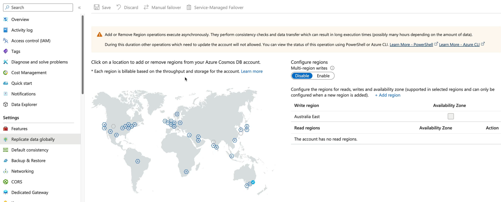
 5. Default Consistency Level:
    - In the Cosmos DB account settings, navigate to "Default consistency."
    - Here you can choose the default consistency level for your account, which determines how data is replicated and read across regions.
    - The available consistency levels are Strong, Bounded Staleness, Session, Consistent Prefix, and Eventual. Each level offers different trade-offs between consistency and performance, so choose the one that best fits your application's requirements. 
    - Note: Literally, there are music notes :). 
    - 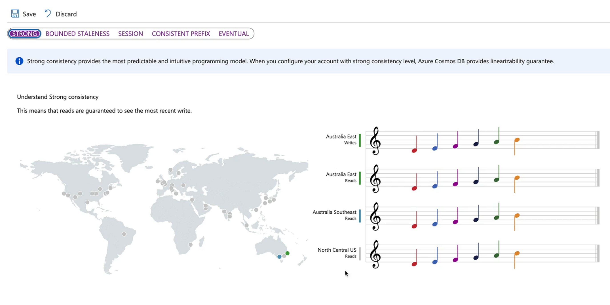
  6. Navigate to the Data Explorer and click on the container you created. You can create a new database, and set your RU's (Request Units) for the container. You can also add items to the container by clicking on "Items" and then "New Item." This allows you to insert JSON documents into your Cosmos DB container, which can be queried later using SQL-like syntax or other APIs depending on the chosen data model.
  7. Create a new item in the container by clicking on "Items" and then "New Item." This allows you to insert JSON documents into your Cosmos DB container, which can be queried later using SQL-like syntax or other APIs depending on the chosen data model. Let's make this some sort of character from Lord of the Rings, since we are using the name "Bilbo Baggins" in our example. You can add more items to the container to create a richer dataset for your application.
  8. Create another item: the Ring of Power, with the following JSON document:
   ```json
   {
     "id": "2",
     "name": "The One Ring",
     "description": "A powerful ring created by Sauron to control all other rings of power.",
     "owner": "Sauron"
   }
   ```
  9. Now you have two items in your container: Bilbo Baggins and The One Ring. You can query these items using the Data Explorer or through your application code using the appropriate API for your chosen data model. For example, you can use SQL-like queries to retrieve items based on specific criteria, such as finding all items where the owner is "Sauron" or retrieving all items with a specific name. This allows you to build powerful applications that can leverage the flexibility and scalability of Cosmos DB to manage and query your data efficiently.
 
# Azure SQL Overview
---
Azure SQL Database is a fully managed relational database service provided by Microsoft Azure. It offers a scalable and secure platform for building and managing SQL databases in the cloud. Azure SQL Database provides built-in intelligence, high availability, and global scalability, making it an ideal choice for modern applications that require a reliable and performant database solution. It supports various deployment options, including single databases, elastic pools, and managed instances, allowing you to choose the best fit for your application's needs. With Azure SQL Database, you can easily create, manage, and scale your SQL databases while benefiting from the security and performance features offered by Azure.

## Architecture
---
Azure SQL Database is built on a multi-tenant architecture, where multiple databases are hosted on the same underlying infrastructure. Each database is isolated and secure, with its own set of resources and configurations. The service is designed to provide high availability and performance, with features such as automatic backups, geo-replication, and built-in intelligence for performance tuning and threat detection. Azure SQL Database also integrates with other Azure services, such as Azure Functions, Azure Logic Apps, and Azure Data Factory, allowing you to build comprehensive data solutions that leverage the power of the Azure ecosystem. With its flexible deployment options and robust feature set, Azure SQL Database is a powerful choice for developers and businesses looking to build scalable and secure applications in the cloud.

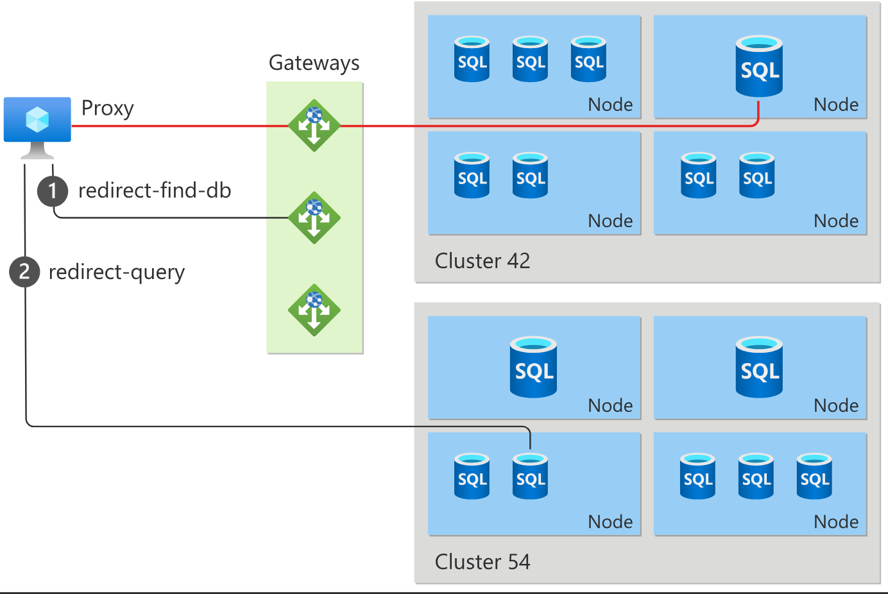

This is a cloud version of SQL Server, a Relational Online Transaction Processing (OLTP) database service. It is designed to handle high transaction volumes and provide low-latency access to data. Azure SQL Database supports various data models, including relational, JSON, and spatial data, making it versatile for different use cases.

Synapse is considered an OLAP (Online Analytical Processing) database service, which is optimized for large-scale data warehousing and analytics. It is designed to handle complex queries and provide fast query performance on large datasets. Synapse integrates with Azure SQL Database, allowing you to use both services together for a complete data solution.

Deployments:
- Azure SQL Server on Azure VMs
- Azure SQL Managed Instance - A fully managed instance of SQL Server that provides near 100% compatibility with the latest SQL Server on-premises database engine.
- Azure SQL Database - A fully managed database service that provides built-in intelligence, high availability, and global scalability for modern applications.
Models:
vCore - A compute model that allows you to choose the number of virtual cores (vCores) and memory for your database, providing flexibility in resource allocation. Serverless, Azure Hybrid Benefit.
DTU (Database Transaction Unit) - A performance model that combines CPU, memory, and I/O resources into a single unit, simplifying resource management and performance tuning. Not serverless, no Azure Hybrid Benefit. :(

# Azure SQL VMs
---
Azure SQL VMs provide a fully managed SQL Server instance running on Azure virtual machines. This option is ideal for customers who require full control over the SQL Server instance and its configuration, including the ability to install custom software, manage security settings, and perform advanced configurations. Azure SQL VMs support various SQL Server editions, including Standard, Enterprise, and Developer, allowing you to choose the best fit for your application's needs.

- Need to patch the server
- Need to manage the server
- Need to manage the databases
- Need to manage the backups
- Need to manage the security

## Key Features
---
- **Scalability**: Azure SQL Database can scale up or down based on your application's needs, allowing you to handle varying workloads without downtime.
- **High Availability**: The service provides built-in high availability with automatic backups, geo-replication, and failover capabilities, ensuring your data is always accessible.
- **Security**: Azure SQL Database offers advanced security features, including encryption at rest and in transit, threat detection, and auditing, to protect your data from unauthorized access and threats.
- **Intelligent Performance**: The service includes built-in intelligence for performance tuning, query optimization, and automatic indexing, helping you achieve optimal performance for your applications.
- **Integration with Azure Services**: Azure SQL Database seamlessly integrates with other Azure services, such as Azure Functions, Azure Logic Apps, and Azure Data Factory, enabling you to build comprehensive data solutions that leverage the power of the Azure ecosystem.

# Azure SQL Managed Instance
---
Azure SQL Managed Instance is a fully managed instance of SQL Server that provides near 100% compatibility with the latest SQL Server on-premises database engine. It offers a seamless migration path for existing SQL Server workloads to Azure, allowing you to lift and shift your applications without the need for code changes. Managed Instance provides built-in high availability, automated backups, and advanced security features, making it an ideal choice for customers who want the benefits of a fully managed service while maintaining compatibility with their existing SQL Server applications.

- OS and server management is handled by Azure - you deploy to a logical SQL Server instance, and Azure takes care of the underlying infrastructure.
- Database management is handled by Azure
- Backups are handled by Azure
- Security is handled by Azure
## Elastic Pools
---
Elastic pools are a cost-effective solution for managing multiple databases with varying and unpredictable usage patterns. They allow you to share resources, such as CPU and memory, across a group of databases, providing flexibility and cost savings. With elastic pools, you can easily scale resources up or down based on the needs of your databases, ensuring optimal performance while minimizing costs.

Per database, there is a lot of waste - elastic pools allow you to share resources across multiple databases, which can be more cost-effective than provisioning resources for each database individually. This is especially beneficial for applications with varying workloads, as it allows you to optimize resource allocation and reduce costs.

## Key Features
---
- **Compatibility**: Azure SQL Managed Instance offers near 100% compatibility with the latest SQL Server on-premises database engine, allowing for easy migration of existing applications without code changes.
- **High Availability**: The service provides built-in high availability with automatic backups, geo-replication, and failover capabilities, ensuring your data is always accessible.
- **Security**: Azure SQL Managed Instance offers advanced security features, including encryption at rest and in transit, threat detection, and auditing, to protect your data from unauthorized access and threats.
- **Intelligent Performance**: The service includes built-in intelligence for performance tuning, query optimization, and automatic indexing, helping you achieve optimal performance for your applications.
- **Integration with Azure Services**: Azure SQL Managed Instance seamlessly integrates with other Azure services, such as Azure Functions, Azure Logic Apps, and Azure Data Factory, enabling you to build comprehensive data solutions that leverage the power of the Azure ecosystem.

# Azure SQL Pricing and Service Tiers
---
Azure SQL Database offers various pricing models and service tiers to accommodate different workloads and budget requirements. The pricing is based on the compute resources (vCores or DTUs), storage, and additional features such as geo-replication and backup retention.

vCore Service Tiers:
- **General Purpose**: Designed for most business workloads, offering balanced compute and storage options with built-in high availability. 1-35 day Short Term Retention, 10y Long Term Retention, and up to 100 TB of storage.
  - One Replica, no read replicas, 99.99% availability SLA. 
- **Business Critical**: Provides the highest performance and availability, with features such as in-memory OLTP and enhanced security, ideal for mission-critical applications.
- **Hyperscale**: A scalable service tier that allows for rapid growth and high performance, with support for up to 100 TB of storage and up to 100,000 concurrent connections, making it suitable for large-scale applications.

MSLearn: https://learn.microsoft.com/en-us/azure/azure-sql/database/service-tier-hyperscale?view=azuresql

DTU Service Tiers:
- **Basic**: Suitable for small databases with light workloads, offering a limited set of features and a maximum of 5 DTUs. Standard page blobs up to 2 GB, 7-day backup retention, and up to 2 GB of storage.
- **Standard**: Designed for most business workloads, offering a balance of performance and cost with a range of DTU options from 10 to 300 DTUs. Page blobs up to 250 GB, 35-day backup retention, and up to 1 TB of storage.
- **Premium**: Provides the highest performance and availability, with features such as in-memory OLTP and enhanced security, ideal for mission-critical applications, with DTU options from 125 to 4000 DTUs. Page blobs up to 4 TB, 35-day backup retention, and up to 4 TB of storage.

# Demo: Create and Explore Azure SQL Database
---
1. Create an Azure SQL VM:
   - Go to the Azure portal and click on "Create a resource."
   - Search for "SQL Server on Azure Virtual Machines" and select it.
   - Click "Create" and fill in the required details, such as subscription, resource group, VM name, region, and SQL Server edition.
   - Review and create the VM. This process may take a few minutes.
2. Connect to the SQL VM:
   - Once the VM is created, navigate to it and click on "Connect."
   - Choose the appropriate connection method (e.g., RDP or SSH) and follow the instructions to connect to the VM.
   - Open SQL Server Management Studio (SSMS) or any other SQL client tool and connect to the SQL Server instance using the VM's public IP address and the SQL Server credentials you provided during the VM creation.
3. Create a new database:
   - In SSMS, right-click on the "Databases" node and select "New Database."
   - Provide a name for the database (e.g., "MyDatabase") and configure any additional settings as needed.
   - Click "OK" to create the database.
4. Create a new table:
   - In SSMS, expand the newly created database and right-click on the "Tables" node.
   - Select "New Table" and define the table structure by adding columns, data types, and constraints.
   - For example, create a table named "Customers" with columns for "CustomerID", "FirstName", "LastName", and "Email".
   - Save the table with a name (e.g., "Customers").
5. Insert data into the table:
   - In SSMS, right-click on the "Customers" table and select "Edit Top 200 Rows."
   - Enter sample data for the columns you defined in the previous step.
   - For example, add a few customer records with names and email addresses.
6. Query the data:
   - In SSMS, open a new query window and write a SQL query to retrieve data from the "Customers" table.
   - For example, use the following query:
   ```sql
   SELECT * FROM Customers;
   ```
   - Execute the query to see the results in the results pane.
Note: You can also just deploy a normal Windows VM, install SQL Server, and then connect to it using SSMS or any other SQL client tool. This is a more manual approach but allows for greater flexibility in configuring the SQL Server instance.

Next...

1. Browse into Azure and create a new Azure SQL Server (logical) instance:
   - Go to the Azure portal and click on "Create a resource."
   - Search for "Azure SQL Database" and select it.
   - Click "Create" and fill in the required details, such as subscription, the same resource group, server name, region, and SQL Server admin login. and authentication method.
   - Review and create the SQL Server instance. This process may take a few minutes.
2. Create a new database on the SQL Server instance:
   - Once the SQL Server instance is created, navigate to it and click on "Create a database."
   - Provide a name for the database (e.g., "MyAzureSQLDatabase") and configure any additional settings as needed, such as the service tier and performance level.
   - Click "Create" to create the database.
3. Connect to the Azure SQL Database:
   - In the Azure portal, navigate to the newly created database and click on "Connection strings."
   - Copy the connection string for ADO.NET or any other client you prefer.
   - Use this connection string in your SQL client tool (e.g., SSMS) to connect to the Azure SQL Database using the admin login credentials you provided during the SQL Server instance creation.

# Demo: Configure an Entra ID Identity for Azure SQL Database
---
1. In the Azure portal, navigate to your Azure SQL Database instance.
2. Click on "Active Directory admin" under the "Settings" section.
3. Click on "Set admin" and select the user or group from your Entra ID that you want to assign as the Active Directory admin for the Azure SQL Database.
4. Click "Save" to apply the changes. This will allow the selected user or group to manage the Azure SQL Database using their Entra ID credentials, providing a more secure and centralized authentication mechanism.
5. Within the database in SSMS, you can now create a new user that is associated with the Entra ID identity you just configured. This allows you to manage database permissions and access control using Azure Active Directory, enhancing security and simplifying user management for your Azure SQL Database.
```sql
CREATE USER [your-username] FROM EXTERNAL PROVIDER;
ALTER ROLE db_datareader ADD MEMBER [your-username];
ALTER ROLE db_datawriter ADD MEMBER [your-username];
```

# Azure Storage Overview
---
Azure Storage is a cloud-based storage solution provided by Microsoft Azure that offers scalable, durable, and secure storage for a wide range of data types, including blobs, files, queues, and tables. It is designed to meet the needs of modern applications, providing high availability, low latency, and global accessibility. Azure Storage offers various storage services, such as Blob Storage for unstructured data, File Storage for file shares, Queue Storage for messaging, and Table Storage for NoSQL key-value data. With its robust features and integration with other Azure services, Azure Storage is an essential component for building scalable and resilient applications in the cloud.
- highly available
- massively scalable
- accessible
- durable
- secure

Four different products:
Blob Storage: A service for storing large amounts of unstructured data, such as text and binary data. It is ideal for storing files, images, videos, and backups.
File Storage: A service for storing and sharing files across applications and users. It provides a fully managed file share in the cloud that can be accessed via SMB protocol.
Queue Storage: A service for storing and managing messages that can be accessed from anywhere in the world. It is designed for decoupling application components and enabling asynchronous communication.
Table Storage: A service for storing structured NoSQL data in a key-value format. It is ideal for applications that require fast access to large amounts of data with a flexible schema, such as user profiles, device information, and other metadata.

These all exist in a STORAGE ACCOUNT.
- Multiple storage services can exist within a single storage account.
- Built for public access by design.
- Name is unique and used for DNS resolution. The storage account name must be between 3 and 24 characters in length and can contain only lowercase letters and numbers.

Performance tiers:
- Premium: Optimized for high-performance workloads that require low latency and high throughput, such as databases, big data analytics, and media processing.
- Standard: Designed for general-purpose workloads that require a balance of performance and cost, such as web applications, mobile applications, and backup storage.

Redundancy options:
- Locally Redundant Storage (LRS): Replicates data three times within a single data center in the same region, providing protection against hardware failures.
- Zone-Redundant Storage (ZRS): Replicates data across three availability zones within the same region, providing protection against zone failures.
- Geo-Redundant Storage (GRS): Replicates data to a secondary region, providing protection against regional outages. The secondary region is typically hundreds of miles away from the primary region, ensuring that data is available even in the event of a complete regional failure.
- Geo-Zone-Redundant Storage (GZRS): Combines the benefits of ZRS and GRS by replicating data across three availability zones in the primary region and replicating it to a secondary region, providing protection against both zone and regional failures.
- Read-Access Geo-Zone-Redundant Storage (RA-GZRS): Similar to GZRS, but also allows read access to the secondary region, providing additional availability and performance benefits for read-heavy workloads. This option is ideal for applications that require high availability and low latency for read operations, even in the event of a regional outage.
- Read-Access Geo-Redundant Storage (RA-GRS): Similar to GRS, but also allows read access to the secondary region, providing additional availability and performance benefits for read-heavy workloads. This option is ideal for applications that require high availability and low latency for read operations, even in the event of a regional outage.
Type: Blob Storage, File Storage, Queue Storage, Table Storage

- General Purpose V2 - Standard HDD - recommended for most scenarios, supports all storage types and features.
- Premium block blobs - low latency and high throughput for workloads that require fast access to block blobs, such as media processing and big data analytics.
- Premium page blobs - high-performance storage for workloads that require low latency and high throughput for page blobs, such as virtual machine disks and databases.
- Premium file shares - high-performance file shares for workloads that require low latency and high throughput, such as media processing and big data analytics. NFS Support

# Demo: Create a Storage Account
---
1. In the Azure portal, click on "Create a resource."
2. Search for "Storage account" and select it from the list of results.
3. Click "Create" and fill in the required details, such as subscription, resource group, storage account name, region, performance tier, and redundancy option.
4. Review the settings and click "Create" to create the storage account. This process may take a few minutes.
5. Once the storage account is created, navigate to it and explore the different storage services available, such as Blob Storage, File Storage, Queue Storage, and Table Storage. You can create containers, file shares, queues, and tables within the storage account to organize and manage your data according to your application's needs
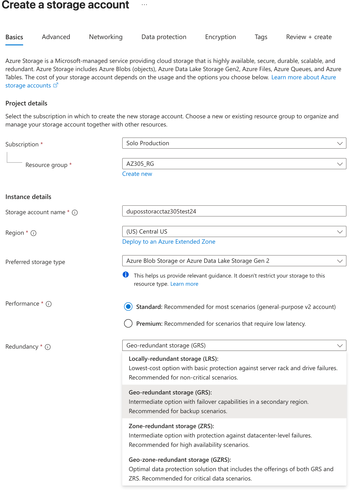
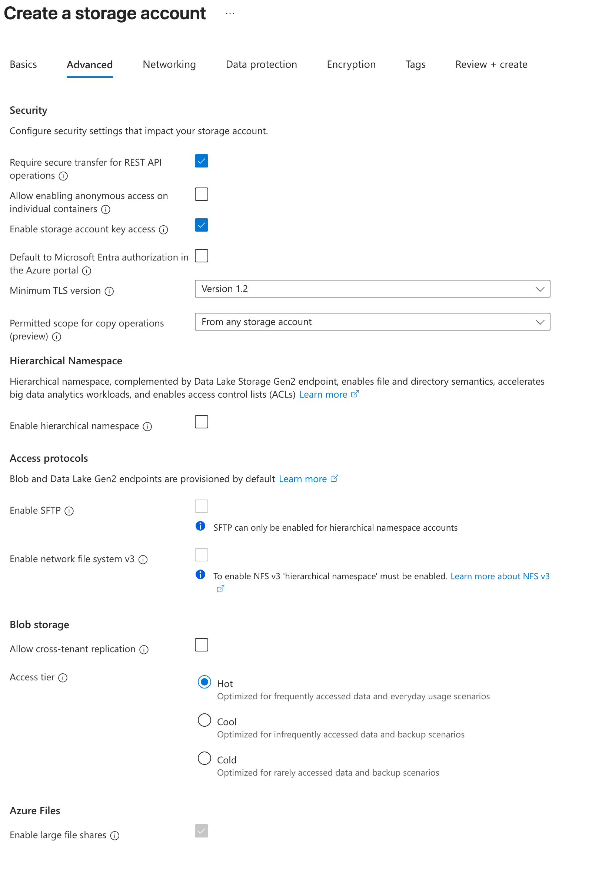
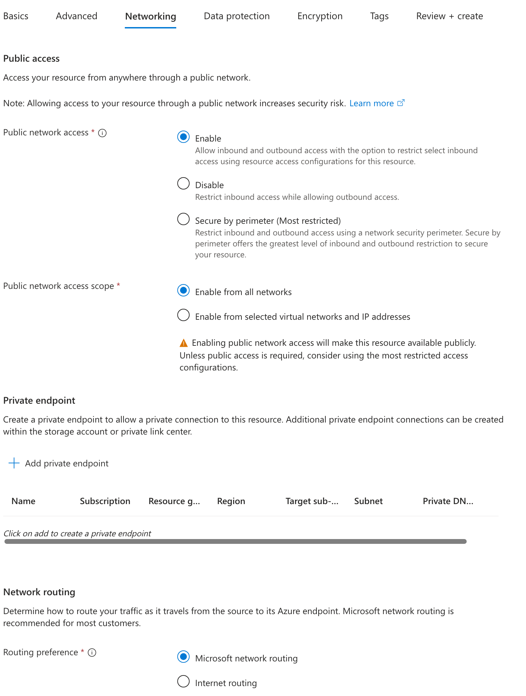
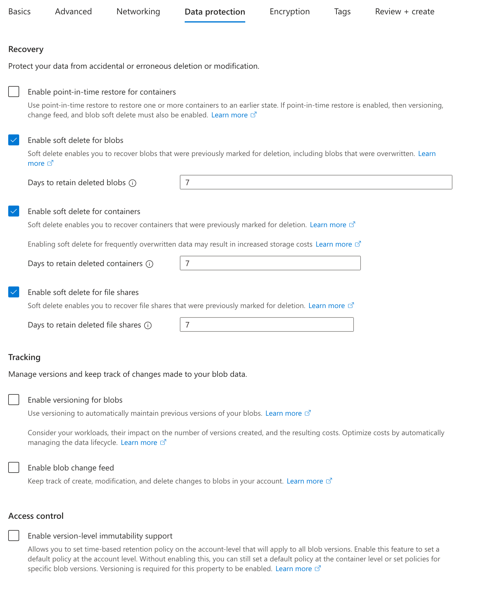
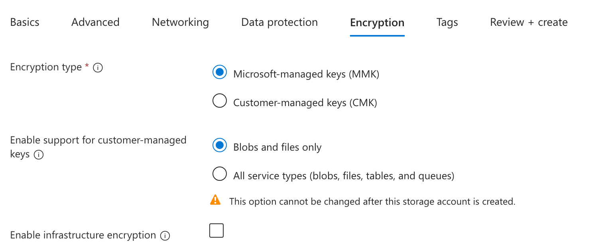

# Azure Blob Storage Overview
---

BLOB: Binary Large Object.

Azure Blob Storage is a service for storing large amounts of unstructured data, such as text and binary data. It is ideal for storing files, images, videos, and backups. Blob Storage provides a scalable and secure platform for managing and accessing your data in the cloud. It offers features such as tiered storage options, lifecycle management policies, and integration with other Azure services, making it a versatile solution for a wide range of applications.

Blob Storage is designed to handle massive amounts of data and can scale to meet the needs of your application. It supports various data access patterns, including streaming, random access, and sequential access, making it suitable for a wide range of use cases, from web applications to big data analytics.

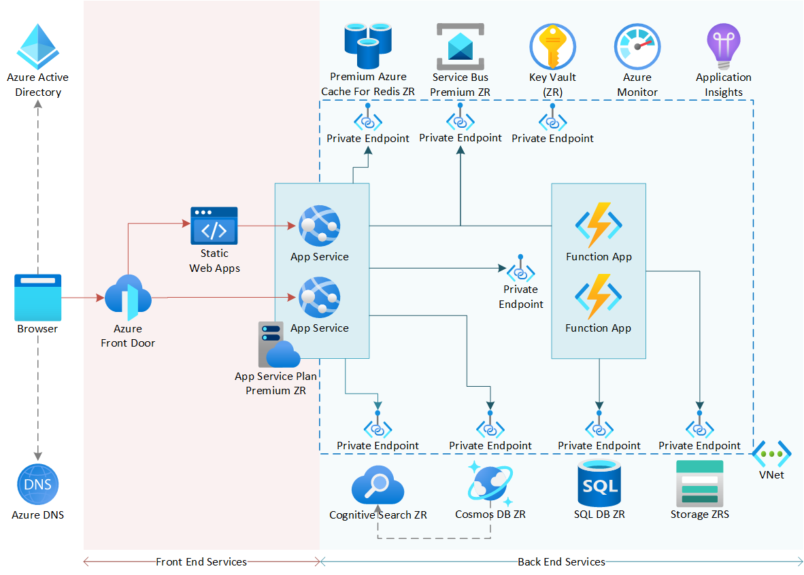
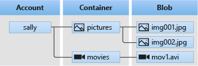

Append Blobs - logs, data that is continuously added to.
Block Blobs - files, images, videos, and other unstructured data that can be uploaded in blocks.
Page Blobs - virtual machine disks and other large files that require random read/write access.

Imagine if you have a blob.txt file. You can upload it as a block blob, which allows you to upload the file in smaller blocks and then commit those blocks together to create the final blob. This is useful for large files or when you want to upload data in parallel. You can also have versions of that blob.txt, allowing you to update and revert to previous versions if needed. This is particularly useful for scenarios like backups or when you want to maintain a history of changes to your data.

Blob Snapshots - point-in-time copies of a blob that can be used for backup and restore purposes. They allow you to capture the state of a blob at a specific moment in time, providing a way to recover data in case of accidental deletion or corruption.

Soft Deleted Blobs - When a blob is deleted, it is not immediately removed from the storage account. Instead, it is marked as "soft deleted" and can be recovered within a specified retention period. This feature provides an additional layer of protection against accidental deletions, allowing you to restore the blob if needed.

# Demo: Working with Blob Storage
---
To create a blob in Azure Blob Storage, you can use the Azure portal, Azure CLI, or Azure Storage Explorer. Here’s how to do it using the Azure portal:
1. Navigate to your Azure Storage account in the Azure portal.
2. Click on "Blob service" in the left-hand menu and then select "Containers."
3. Click on "Create container" and provide a name for the container (e.g., "mycontainer") and set the access level (e.g., private, blob, or container). Click "Create" to create the container.
4. Once the container is created, click on it to open it, and then click on "Upload" to upload a file from your local machine. You can select a file (e.g., "blob.txt") and click "Upload" to add it to the container.
5. You can download or upload more files (BLOBS)
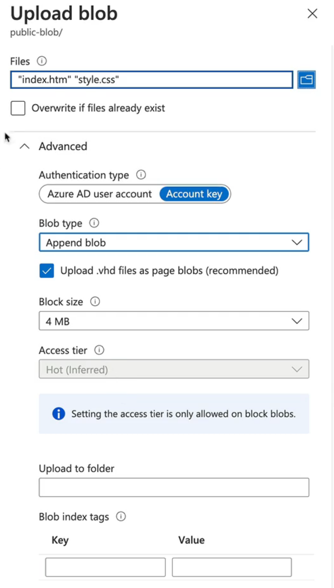

This is a way to create a static website using Azure Blob Storage. You can enable static website hosting on your storage account, which allows you to serve static content (HTML, CSS, JavaScript) directly from a blob container. This is useful for hosting simple websites or web applications without the need for a web server.
To enable static website hosting on Azure Blob Storage:
1. Navigate to your Azure Storage account in the Azure portal.
2. Click on "Static website" under the "Settings" section.
3. Click on "Enabled" to enable static website hosting.
4. Specify the index document name (e.g., "index.html") and the error document name (e.g., "error.html").
5. Click "Save" to apply the changes.
6. Once static website hosting is enabled, you can upload your static files (HTML, CSS, JavaScript) to the $web container in your blob storage. The $web container is a special container that is used for hosting static websites. You can upload your files using the Azure portal, Azure CLI, or Azure Storage Explorer. After uploading your files, you can access your static website using the primary endpoint URL provided in the Azure portal under the "Static website" settings. This URL will allow you to access your static website directly from Azure Blob Storage, making it a cost-effective and scalable solution for hosting static content.

## Create Snapshots and Soft Deleted Blobs
To create a snapshot of a blob in Azure Blob Storage:
1. Navigate to your Azure Storage account in the Azure portal.
2. Click on "Blob service" in the left-hand menu and then select "Containers."
3. Click on the container that contains the blob you want to snapshot.
4. Click Create Snapshot.
5. In the "Create Snapshot" pane, provide a name for the snapshot and click "Create" to create the snapshot. The snapshot will be created as a read-only copy of the blob at the point in time when the snapshot was taken.
6. View the properties, notive that the URL is now different, and the snapshot is listed under the blob's properties. You can manage snapshots, such as deleting them or restoring the blob to a previous snapshot if needed.
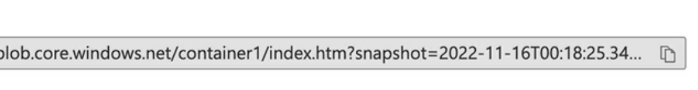

## Deleting a blob and recovering it using soft delete:
1. Navigate to your Azure Storage account in the Azure portal.
2. Click on "Blob service" in the left-hand menu and then select "Containers."
3. Click on the container that contains the blob you want to delete.
4. Click on the blob you want to delete and then click "Delete" to delete the blob. The blob will be marked as "soft deleted" and will not be permanently removed from the storage account immediately.
5. To recover the soft deleted blob, navigate to the "Deleted blobs" section in the Azure portal under the "Blob service" settings. Here you can see a list of soft deleted blobs and their retention periods. Select the blob you want to recover and click "Restore" to restore it to its original state. The blob will be moved back to the container and will be available for use again. Note that the retention period for soft deleted blobs is configurable, and you can set it according to your needs. By default, the retention period is 7 days, but you can configure it to be longer or shorter based on your requirements. This feature provides an additional layer of protection against accidental deletions, allowing you to recover data if needed.

Note: Folders don't really work in Azure Blob Storage, but you can use virtual directories by including slashes (/) in the blob name. For example, if you want to create a folder structure like "images/photos", you can name your blob "images/photos/myphoto.jpg". This will create a virtual directory structure in the Azure portal, allowing you to organize your blobs in a way that resembles folders.

Configure a storage account with Hierarchical Namespace to enable Azure Data Lake Storage Gen2 features. This allows you to use the storage account for big data analytics and provides features such as file system semantics, directory-level security, and improved performance for analytics workloads.

## Blob Storage Access Tiers
---
Azure Blob Storage offers different access tiers to optimize costs based on how frequently data is accessed. The access tiers include:
- **Hot Tier**: Optimized for data that is accessed frequently. It provides the lowest access latency and the highest availability, making it ideal for active data that is used regularly.
- **Cool Tier**: Designed for data that is infrequently accessed but still needs to be available immediately when needed. It offers lower storage costs compared to the hot tier but has higher access costs, making it suitable for data that is accessed less frequently, such as backups and long-term storage.
- **Cold Tier**: Intended for data that is rarely accessed and can tolerate higher access latency. It provides the lowest storage costs but has the highest access costs and latency, making it ideal for long-term archival of data that is not expected to be accessed frequently, such as compliance records or historical data.
- **Archive Tier**: Intended for data that is rarely accessed and can tolerate higher access latency. It provides the lowest storage costs but has the highest access costs and latency, making it ideal for long-term archival of data that is not expected to be accessed frequently, such as compliance records or historical data.

A good way to think about this is taking your files that you have on your desk, moving them to a filing cabinet (cool tier), and then moving them to an off-site storage facility or your garage (archive tier) when you no longer need immediate access to them.

Note: Archive tier needs time to rehydrate the data before it can be accessed, which can take several hours. This is important to consider when choosing the appropriate access tier for your data, as it may impact the performance and availability of your applications that rely on that data.


Note: Memorize these key facts about Azure Blob Storage:
- Blob Storage is designed for unstructured data, such as text and binary data.
- It offers different access tiers (Hot, Cool, Cold, Archive) to optimize costs based on how frequently data is accessed.
- Blob Storage supports different blob types (Block Blobs, Append Blobs, Page Blobs) to accommodate various use cases and data access patterns.
- Snapshots and soft delete features provide additional data protection and recovery options for your blobs.
- Azure Blob Storage is highly scalable, durable, and secure, making it an ideal choice for storing large amounts of unstructured data in the cloud.

# Demo: Configure Access Tiers for Blob Storage
1. Navigate to your Azure Storage account in the Azure portal.
2. Click on "Blob service" in the left-hand menu and then select "Containers."
3. Click on the container that contains the blob you want to configure.
4. Click on the blob you want to configure and then click on "Change tier" in the top menu.
5. In the "Change access tier" pane, select the desired access tier (Hot, Cool, Cold, or Archive) and click "Save" to apply the changes. The blob will be moved to the selected access tier, and the storage costs will be adjusted accordingly based on the new tier. Note that changing the access tier may take some time, especially when moving to the Archive tier, as it requires rehydration of the data before it can be accessed. Be sure to consider the access patterns and performance requirements of your applications when choosing the appropriate access tier for your blobs.

# Blob storage lifecycle management
---
Azure Blob Storage provides lifecycle management policies that allow you to automate the transition of blobs between access tiers and the deletion of blobs based on specified rules. This feature helps you optimize storage costs by automatically moving data to the appropriate access tier or deleting it when it is no longer needed.

# Demo - Configure lifecycle management policies
---
To configure lifecycle management policies for your Azure Blob Storage:
1. Navigate to your Azure Storage account in the Azure portal.
2. Click on "Blob service" in the left-hand menu and then select "Lifecycle management."
3. Click on "Add rule" to create a new lifecycle management rule.
4. In the "Add rule" pane, provide a name for the rule and specify the conditions for the rule, such as the blob prefix, blob type, and the number of days after the last modification date.
5. Define the actions to be taken when the conditions are met, such as moving the blob to a different access tier (Hot, Cool, Cold, Archive) or deleting the blob.
6. Click "Save" to apply the lifecycle management rule. The rule will be applied to the blobs in your storage account based on the specified conditions, and the actions will be executed automatically when the conditions are met. This allows you to manage your blob storage efficiently and optimize costs by automatically transitioning data to the appropriate access tier or deleting it when it is no longer needed.

Blob index tags - You can add custom metadata to your blobs in the form of key-value pairs, which can be used for indexing and searching your blobs. This allows you to organize and manage your blobs more effectively, making it easier to find and access specific blobs based on their metadata.

# Azure Files
---
Azure Files is a fully managed file share service that allows you to create and manage file shares in the cloud. It provides a fully managed file share in the cloud that can be accessed via the Server Message Block (SMB) protocol, making it compatible with a wide range of applications and operating systems. Azure Files is ideal for scenarios where you need to share files across multiple virtual machines or applications, such as web applications, mobile applications, and backup storage.

* Windows - SMB
* Linux - NFS

Tiers:
- Premium - supports NFS and SMB, the others only support SMB.
- Transaction optimized
- Hot
- Cool

SMB: supports all tiers and redundancy
NFS: supports only Premium tier and LRS/ZRS redundancy

# Demo: Create an Azure File Share
---
1. Navigate to your Azure Storage account in the Azure portal.
2. Click on "File service" in the left-hand menu and then select "File shares."
3. Click on "Create file share" and provide a name for the file share (e.g., "myfileshare") and select the desired performance tier (Premium, Transaction optimized, Hot, or Cool).
4. Click "Create" to create the file share. Once the file share is created, you can access it using the SMB protocol from Windows or the NFS protocol from Linux. To access the file share, you can use the connection string provided in the Azure portal under the "File shares" settings. This connection string will allow you to mount the file share on your local machine or virtual machine, enabling you to read and write files to the Azure File Share as if it were a local file system. You can also manage the file share using Azure Storage Explorer or the Azure CLI, allowing you to upload, download, and organize your files in the cloud.
Note: when you create a file share, you will be charged for the provisioned storage capacity and the data transfer costs associated with accessing the file share. Be sure to monitor your usage and adjust the performance tier or storage capacity as needed to optimize costs.
5. Connect to this using Powershell or the command line. Azure does give you a small script that can be more secure.
6. For example, to mount the file share on a Windows machine using PowerShell, you can use the following command:
```powershell
New-PSDrive -Name Z -PSProvider FileSystem -Root "\\<storage-account-name>.file.core.windows.net\<file-share-name>" -Credential (Get-Credential)
```
Replace `<storage-account-name>` with the name of your Azure Storage account and `<file-share-name>` with the name of your file share. This command will prompt you for your Azure Storage account credentials and then mount the file share as a drive (e.g., Z:) on your local machine, allowing you to access and manage files in the Azure File Share as if it were a local drive.

# Azure File Sync
---
Azure File Sync is a service that allows you to synchronize files between your on-premises Windows Server and Azure File Shares. It enables you to centralize your file shares in Azure while keeping the flexibility and performance of local file access. With Azure File Sync, you can cache frequently accessed files on your local server for fast access, while less frequently accessed files are stored in Azure, providing a seamless hybrid storage solution.

GPv2 or Premium storage accounts are required for Azure File Sync.
Sync Service needs to be registered in the Azure portal and installed on the Windows Server that will be used for synchronization. Once the service is set up, you can create sync groups to define the synchronization relationships between your on-premises servers and Azure File Shares. This allows you to keep your files in sync across multiple locations, ensuring that users have access to the most up-to-date files regardless of where they are stored.

Note: Servers can only be registered to ONE sync service.

A Sync Group is a logical container that defines the synchronization relationship between an Azure File Share and one or more on-premises Windows Servers. Each sync group can have multiple server endpoints, allowing you to synchronize files across multiple servers and locations. For example, you could have a sync group that includes the following server endpoints:
- Cloud endpoint: Azure File Share
- Server endpoints:
  * Main office
  * Branch 1
  * Branch 2
  * Remote office 1

Cloud Tiering: Azure File Sync uses cloud tiering to optimize storage costs and performance. It automatically moves infrequently accessed files to Azure while keeping frequently accessed files on the local server. This allows you to save on storage costs while still providing fast access to the most important files.
- space policy
- date policy
- cache service

SMB, FTP, NFS or some other type of file sharing protocol is used to access the files on the local server, while Azure File Sync handles the synchronization and tiering of files between the local server and Azure File Shares. This allows you to maintain a consistent file access experience for users while leveraging the benefits of cloud storage for scalability and durability.

Conflicts: When multiple users or applications access the same file simultaneously, Azure File Sync can detect conflicts and provide options for resolving them. You can choose to keep the local version, keep the cloud version, or create a new version of the file to preserve both changes. This ensures that data integrity is maintained while allowing for collaboration and concurrent access to files across different locations.

Demo: Configure and Connect to Azure File Sync
---
1. Deploy a VM and put some data in a folder
2. In the Azure portal, navigate to your Azure Storage account and create a new file share if you haven't already.
3. Click on "File service" in the left-hand menu and then select "Sync groups."
4. Click on "Create sync group" and provide a name for the sync group (e.g., "mySyncGroup") and select the Azure File Share you want to synchronize with.
5. Click "Create" to create the sync group. Once the sync group is created, you can register your on-premises Windows Server with the sync group by installing the Azure File Sync agent on the server and following the registration process. This will allow you to synchronize files between your local server and the Azure File Share, enabling you to keep your files in sync across multiple locations and providing a seamless hybrid storage solution.
6. Download they sync agent from the Azure portal and install it on your on-premises Windows Server. During the installation process, you will be prompted to register the server with the sync group you created in the Azure portal. Follow the prompts to complete the registration process, which will allow your server to participate in the synchronization process with the Azure File Share.

To register your on-premises Windows Server with the sync group, you can use the following PowerShell command:
```powershell
Register-AzStorageSyncServer -ResourceGroupName <resource-group-name> -StorageSyncServiceName <sync-service-name> -ServerName <server-name>
```
Replace `<resource-group-name>` with the name of your Azure resource group, `<sync-service-name>` with the name of your Azure File Sync service, and `<server-name>` with the name of your on-premises Windows Server. This command will register the server with the specified sync service, allowing it to participate in the synchronization process with the Azure File Share. Once registered, you can create server endpoints within the sync group to define the synchronization relationships between the server and the Azure File Share. This will enable you to keep your files in sync across multiple locations, ensuring that users have access to the most up-to-date files regardless of where they are stored.  

Note: the Azure File Share is an endpoint as well, we don't want to sync files across servers, but harness the power of Azure. 
Private Endpoints (later discussed) can be used here to secure the connection between your on-premises server and the Azure File Share, ensuring that data is transmitted securely over the network. This is particularly important when synchronizing sensitive data or when compliance requirements dictate that data must be protected during transit.

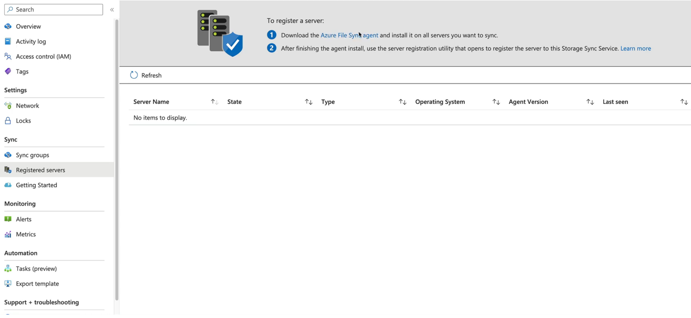

# Case Study
---
Company is expanding to multiple countries.
Application needs to be modernized to support global users with low latency and high availability.
The application is a .NET web application running on Server 2022.
Application must:
- run in all of the countries where the company operates in Azure regions
- each region has local read/write access to the data
- leave the underlying storage architecture

At some point, the application needs updated:
- usin a relational database to store data
- ensuring the same data is available across all regions
- supports read/write across all deployments


Solution:
1. one VM in each region.
2. Azure File Sync across all file servers
3. Relational database - read/write - CosmosDB NOT SQL server

Explanation:
- Azure File Sync allows you to synchronize files across multiple servers and locations, providing a seamless hybrid storage solution. This means that each region can have local read/write access to the data while still keeping the data synchronized across all regions. This is ideal for scenarios where you need to share files across multiple virtual machines or applications, such as web applications, mobile applications, and backup storage.
- Cosmos DB is a globally distributed, multi-model database service that provides high availability, low latency, and elastic scalability for modern applications. It is designed to support read/write access across multiple regions, making it an ideal choice for applications that require global distribution and low latency access to data. With Cosmos DB, you can easily replicate your data across multiple regions, ensuring that your application can access the same data regardless of where it is deployed. This allows you to build a highly available and globally distributed application that can serve users from any region with low latency and high performance.


# Key Terms
---
 * Cosmos DB - A globally distributed, multi-model database service that provides high availability, low latency, and elastic scalability for modern applications.
* Database - A logical container for collections, stored procedures, triggers, and user-defined functions in Cosmos DB. It provides a scope for these resources and allows for resource management and access control.
* Request Units (RUs) are a measure of the throughput capacity of a Cosmos DB container or database. They represent the amount of resources required to perform operations such as reads, writes, and queries. RUs are used to determine the performance and cost of the Cosmos DB service.
