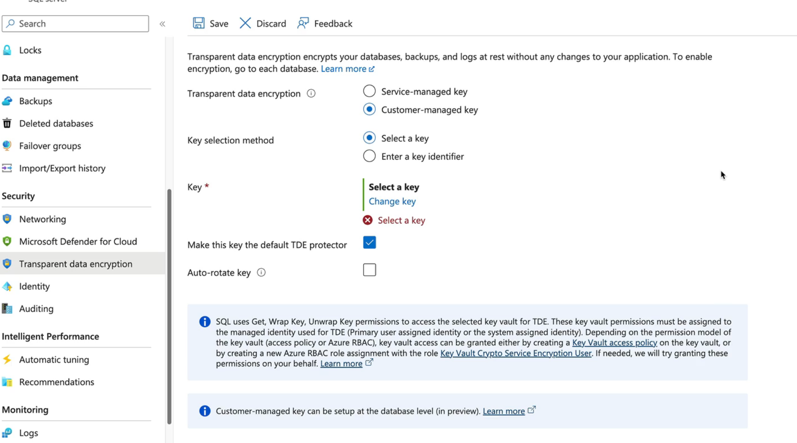
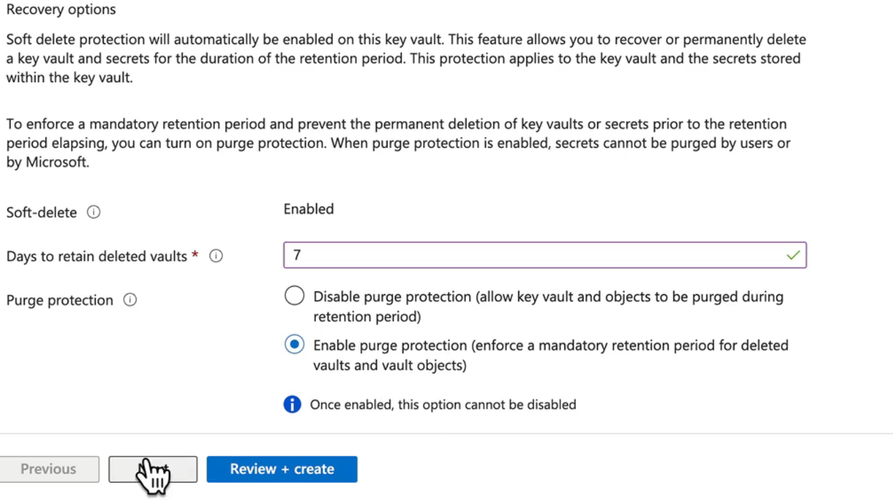
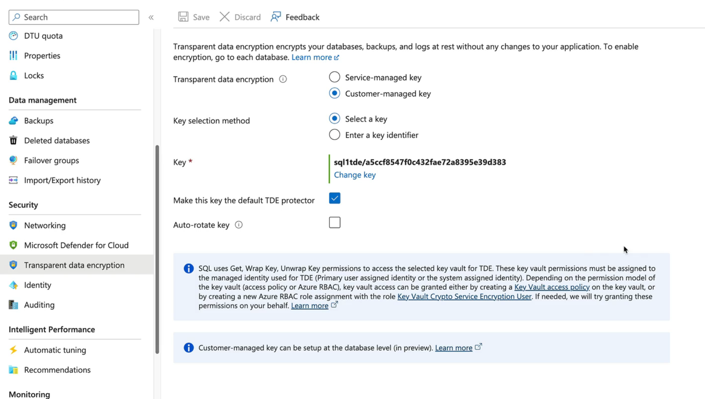
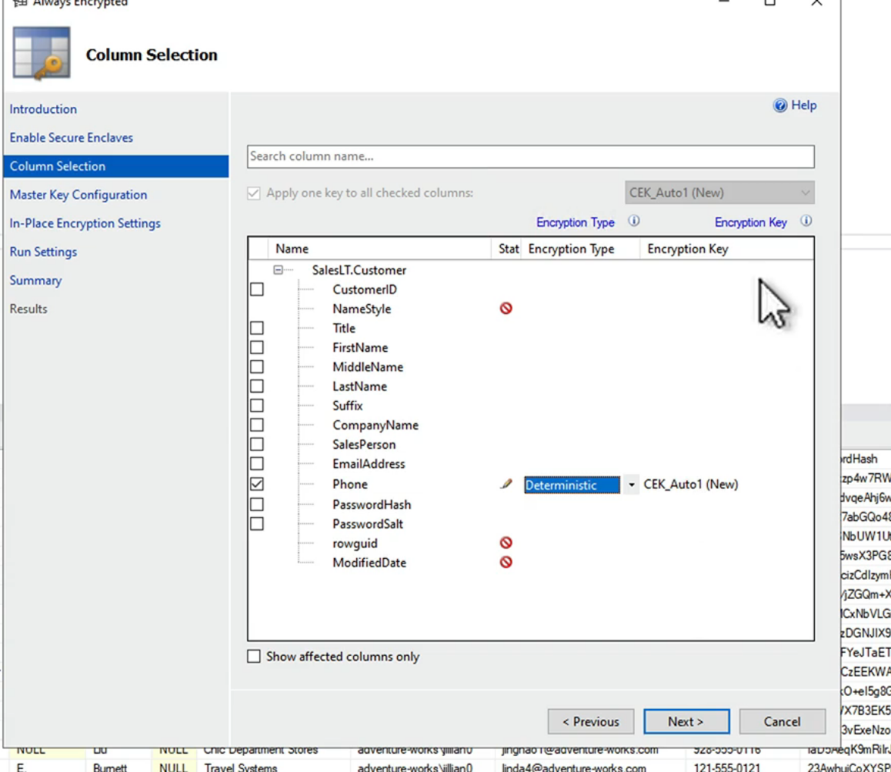
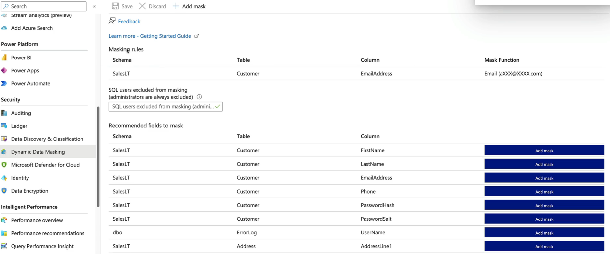
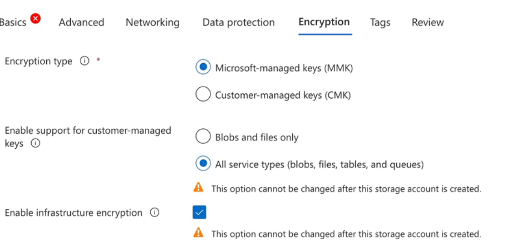
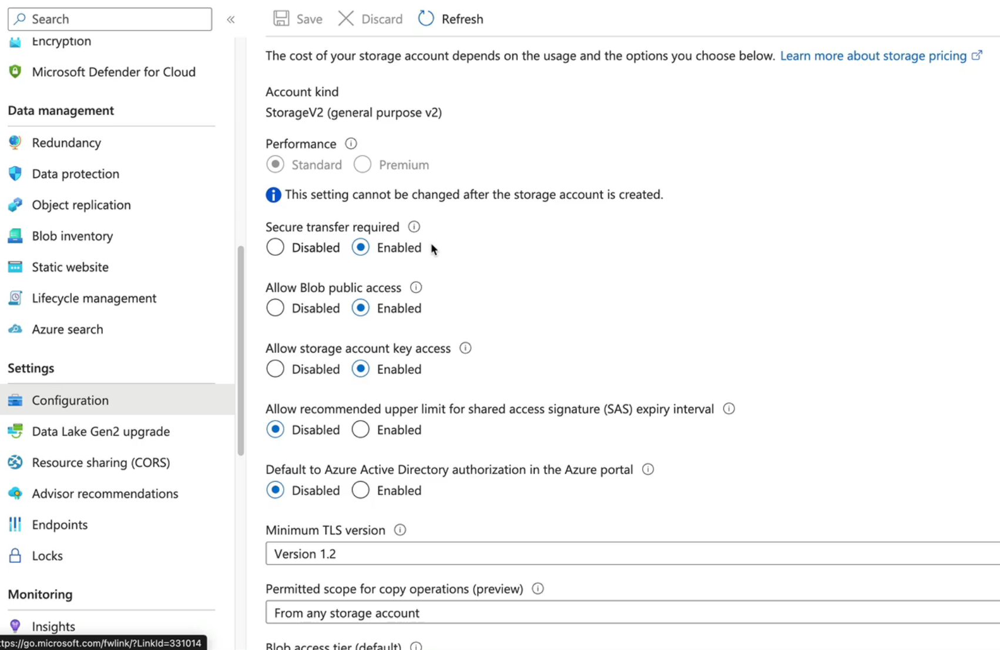
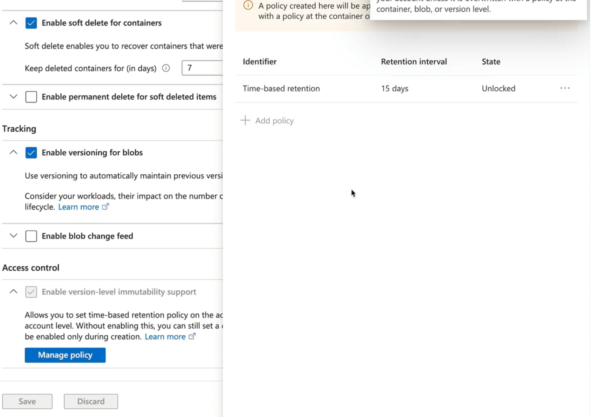

## Overview
---
At this point, you should be at about 69% complete with these notes, Dupo. 

Things to focus on:
-SQL Server and Azure SQL Database
-Cosmos DB and Azure Synapse Link
- Storage accounts and Azure Files
- Blob and block storage
- Azure Data Lake Storage Gen2

# Azure SQL Transparent Data Encryption (TDE)
---
Transparent Data Encryption (TDE) is a security feature in Azure SQL Database that encrypts the data at rest. It helps protect the data from unauthorized access by encrypting the database files, including the data and log files. TDE uses a symmetric key called the Database Encryption Key (DEK) to encrypt the database, and this key is protected by a built-in server certificate. TDE is enabled by default for all Azure SQL Databases, and it provides an additional layer of security to protect sensitive data stored in the database. TDE can be used in conjunction with other security features such as Azure Key Vault to manage the encryption keys and provide additional security controls.

Just because Microsoft protects their infrastructure doesn't mean you shouldn't protect your data. TDE is a great way to ensure that your data is encrypted at rest, and it can help you meet compliance requirements for data protection.

Default encryption for Azure SQL DB, Managed Instance, and Synapse Analytics is TDE. You can also use Azure Key Vault to manage your own keys (DEK or TDE Protector) for TDE, which provides an additional layer of security and control over your encryption keys.

DEK is AES256, DEK Protector is RSA 2048/3072

Need a managed identity for this as well, and you can use Azure Key Vault to store the keys.

# Demo: cConfigure Managed TDE for Azure SQL Database
---
1. Create an Azure Key Vault and a key in it.
   1. You will need to add your account with correct permissions to see the data plane.
   2. Add the managed identity of the SQL Database to the Key Vault access policies with the necessary permissions to use the key for encryption and decryption operations. Usually on the key itself.
2. Create an Azure SQL Database and enable TDE with the key from the Key Vault. This will involve creating a TDE protector in the Key Vault and then configuring the SQL Database to use that protector for TDE.


3. Verify that TDE is enabled and that the database is encrypted using the key from the Key Vault. You can do this by checking the TDE status in the Azure portal or by running a query against the database to check the encryption status.

4. Purge Protection: If you want to disable TDE, you can do so by removing the TDE protector from the Key Vault and then disabling TDE on the SQL Database. This will decrypt the database and remove the encryption.

5. Azure RBAC control, leave network, create.
6. You can also use Azure Policy to enforce TDE on all SQL Databases in your subscription or resource group, ensuring that all databases are encrypted at rest.
7. Enable TDE on the existing server by using the Azure portal or Azure CLI. This will encrypt the existing data in the database and ensure that all new data is encrypted as well.


# Azure SQL Always Encrypted
---
Always Encrypted is a feature in Azure SQL Database that allows you to encrypt sensitive data in the database while still allowing applications to query and manipulate the data without having access to the encryption keys. This is achieved by encrypting the data on the client side before it is sent to the database, and decrypting it on the client side after it is retrieved from the database. This means that the data is always encrypted in transit and at rest, and only authorized users with access to the encryption keys can view the sensitive data. Always Encrypted is designed to protect sensitive data such as credit card numbers, social security numbers, and other personally identifiable information (PII) from unauthorized access, even if the database is compromised. 

You can add a key to a certain column in the database, and then use that key to encrypt the data in that column. The encryption keys are stored in Azure Key Vault, and you can manage them using Azure RBAC and Azure Policy.

The application will need the encryption keys to encrypt and decrypt the data, so you will need to configure the application to use the keys from Azure Key Vault. This can be done using the Azure Key Vault SDK or by using Azure Managed Identities to access the keys securely.

Supports SQL Server, SQL Database and SQL Managed instance.

Encrypt a column using a Column Encryption Key (CEK) that is protected by a Column Master Key (CMK) stored in Azure Key Vault. The application can then use the CEK to encrypt and decrypt the data in the column, while the CMK is used to protect the CEK.

# Demo: Configure Always Encrypted for Azure SQL Database
---
1. Create an Azure Key Vault and a key in it.
2. Create an Azure SQL Database and enable Always Encrypted on a specific column using the key from the Key Vault. This will involve creating a Column Master Key (CMK) in the Key Vault and then creating a Column Encryption Key (CEK) that is protected by the CMK.
3. Verify that Always Encrypted is enabled and that the data in the specified column is encrypted using the key from the Key Vault. You can do this by checking the encryption status of the column in the Azure portal or by running a query against the database to check the encryption status of the column

Optional: Deploy a VM and run SQL Server Management Studio (SSMS) to connect to the Azure SQL Database and verify that the data in the encrypted column is not visible without the encryption keys.
4. View the columns in the database and see that the encrypted column is not visible without the keys. You can also try to query the data in the encrypted column and see that it returns null or an error without the keys.


5. The data itself will be obscured in the database, and you can only see the encrypted value.

# Azure SQL Database Dynamic Data Masking
---
Dynamic Data Masking is a feature in Azure SQL Database that allows you to mask sensitive data in query results without modifying the underlying data in the database. It provides a way to limit sensitive data exposure by masking it to non-privileged users. The data is masked in the query results based on the masking rules defined for each column. This means that users with appropriate permissions can see the full data, while users without permissions will see masked data. Dynamic Data Masking is designed to protect sensitive data such as credit card numbers, social security numbers, and other personally identifiable information (PII) from unauthorized access, while still allowing users to query and manipulate the data without having access to the sensitive information

You can define masking rules for specific columns in the database, and then use Azure RBAC to control who has access to the unmasked data. This allows you to protect sensitive data while still allowing users to query and manipulate the data as needed.

When this is enabled, the data is masked, not encrypted. This means that the underlying data is still stored in the database, but it is masked in the query results based on the defined masking rules. Users with appropriate permissions can see the full data, while users without permissions will see masked data.

TLDR: The query results are masked. Data is not encrypted.

Demo: Configure Dynamic Data Masking for Azure SQL Database
---
1. Create an Azure SQL Database and enable Dynamic Data Masking on specific columns. This will involve defining masking rules for each column that you want to mask, such as using a default masking function or a custom masking function.
2. Verify that Dynamic Data Masking is enabled and that the data in the specified columns is masked in the query results. You can do this by running a query against the database and checking the results for the masked columns. Users with appropriate permissions will see the full data, while users without permissions will see masked data.
3. Optionally, you can create an Azure VM with SQL Server Management Studio (SSMS) installed and connect to the Azure SQL Database to verify that the data in the masked columns is not visible without the appropriate permissions.
4. Test the masking behavior by querying the masked columns with different user accounts to ensure that the masking rules are applied correctly.



# Azure Storage Access Control
---
* Access Keys provide full access
* Managed Identies provide access to specific resources based on RBAC roles
* SAS tokens provide time-limited access to specific resources with specific permissions

What about REST API? 
Azure Storage supports REST API access, and you can use Shared Access Signatures (SAS) to provide secure, time-limited access to specific resources in your storage account. SAS tokens can be generated for specific permissions (read, write, delete, list) and can be scoped to specific resources (blobs, files, queues, tables). This allows you to control access to your storage resources without sharing your account keys, and it provides a secure way to grant temporary access to your storage resources for applications or users that need it.

Access Keys:
- Provide full access to the storage account and all its resources.
- Primary and secondary keys are available, and they can be regenerated if needed.
- Should be stored securely and not shared with unauthorized users.
- Should be rotated regularly to enhance security. Can be disabled if not needed.
- Can be used for programmatic access to the storage account, but should be used with caution, as they provide full access to the storage account.

Entra ID Based Access:
- Provides access to specific resources based on RBAC roles assigned to the managed identity.
- Managed identities can be used to authenticate to Azure Storage without the need for access keys, providing a more secure and manageable way to access storage resources.
- RBAC roles can be assigned to the managed identity to control access to specific resources in the storage account, such as blobs, files, queues, and tables. This allows for fine-grained access control and helps to ensure that only authorized users and applications can access the storage resources.
- Managed identities can be used in conjunction with Azure Key Vault to securely store and manage secrets, certificates, and keys used for authentication and authorization to Azure Storage. This provides an additional layer of security and helps to ensure that sensitive information is protected while still allowing applications to access the necessary resources in Azure Storage.

SAS Tokens:
- Provide time-limited access to specific resources in the storage account with specific permissions.
- Can be generated for specific permissions (read, write, delete, list) and can be scoped to specific resources (blobs, files, queues, tables).
- Should be generated with the least privileges necessary for the task at hand, and should be set to expire after a reasonable amount of time to minimize the risk of unauthorized access.
- Can be used for programmatic access to the storage account, allowing applications to access specific resources without the need for access keys. This provides a more secure way to grant temporary access to storage resources for applications or users that need it, while still maintaining control over the access permissions and duration of access.
- These are client side tokens that act like tickets to a movie. 

You can also use Stored Access Policies to manage SAS tokens more effectively. A stored access policy is a container for shared access signatures (SAS) that provides an additional level of control over the SAS tokens. It allows you to specify the start time, expiry time, and permissions for the SAS tokens associated with the policy. This way, you can manage the SAS tokens more easily by updating the stored access policy instead of having to regenerate individual SAS tokens when you need to change permissions or expiration times.

Account SAS for the entire storage account, Service SAS for specific services (Blob, File, Queue, Table), and User Delegation SAS for Azure AD authenticated users. You sign these with the account key or with Azure AD credentials, depending on the type of SAS token you are generating.

User Delegation SAS is a type of SAS token that is signed with Azure AD credentials instead of the storage account key. This allows you to grant access to specific resources in the storage account based on the permissions assigned to the Azure AD user or service principal. User Delegation SAS tokens are more secure than account keys because they are tied to specific users and can be easily revoked if needed. They also provide better auditing and monitoring capabilities, as you can track which users are accessing the storage resources and what actions they are performing.

Note: Memorize these different types and understand the differences between them, as they are important for controlling access to your storage resources and ensuring the security of your data.

Demo: Access Storage with Keys and Shared Access Signatures (SAS)
---
1. Create an Azure Storage account and generate an access key for it. This will provide you with the necessary credentials to access the storage account programmatically.
2. Create a container in the storage account and upload a blob to it. This will allow you to test access to the storage account using the access key and SAS tokens.
3. Generate a Shared Access Signature (SAS) token for the blob with specific permissions (e.g., read, write) and a defined expiration time. This will allow you to grant temporary access to the blob without sharing the access key.
4. Use the SAS token to access the blob and verify that you can perform the allowed operations (e.g., read the blob content, write to the blob) based on the permissions defined in the SAS token.
5. Optionally, you can also generate a User Delegation SAS token using Azure AD credentials and test access to the blob using that token. This will allow you to grant access based on Azure AD permissions and verify that the User Delegation SAS token works as expected.
```bash
# Example of generating a SAS token using Azure CLI
az storage blob generate-sas \
    --account-name <storage_account_name> \
    --container-name <container_name> \
    --name <blob_name> \
    --permissions rwd \
    --expiry <expiration_time> \
    --output tsv
```

# Demo: Access Azure Storage using Entra ID Identities and RBAC
---
1. Create an Azure Storage account and enable Azure AD authentication for it. This will allow you to use Azure AD identities to access the storage account instead of using access keys.
2. Create a managed identity for an Azure resource (e.g., a virtual machine or an Azure Function) that will access the storage account. This will allow you to authenticate to the storage account using the managed identity.
3. Assign the necessary RBAC roles to the managed identity to grant it access to the storage account. This can include roles like "Storage Blob Data Reader" or "Storage Blob Data Contributor" depending on the level of access required.
4. Use the managed identity to access the storage account programmatically. This can be done using the Azure SDKs or REST APIs, which will automatically use the managed identity for authentication.

Note the differences between the management and data plane permisions. Management plane permissions control access to the storage account itself, while data plane permissions control access to the data within the storage account. Make sure to assign the appropriate roles to the managed identity based on the level of access required for both management and data plane operations.

# Azure Storage Encryption
---
Azure Storage provides encryption for data at rest by default. This means that all data stored in Azure Storage is automatically encrypted using Microsoft-managed keys. This encryption is transparent to users and applications, and it helps protect your data from unauthorized access.

Data at rest is stored on Microsoft Infrastructure. You can use Azure Storage Service Encryption (SSE) to encrypt your data at rest. SSE uses 256-bit AES encryption, which is a strong encryption standard that provides a high level of security for your data. With SSE, your data is automatically encrypted when it is written to Azure Storage and decrypted when it is read, without any additional configuration required on your part. You can also use Azure Key Vault to manage your own encryption keys for Azure Storage, providing an additional layer of security and control over your encryption keys. This allows you to have more control over the encryption process and ensures that your data is protected according to your specific security requirements.

Server Side Encryption (SSE) is enabled by default for all Azure Storage accounts, and it provides an additional layer of security to protect your data at rest. You can also use Azure Key Vault to manage your own encryption keys for Azure Storage, providing an additional layer of security and control over your encryption keys. This allows you to have more control over the encryption process and ensures that your data is protected according to your specific security requirements.

Too many SSE's - confusing :)
The difference is that Azure Storage Service Encryption (SSE) is the default encryption mechanism for data at rest in Azure Storage, while Server Side Encryption (SSE) is a more general term that can refer to any encryption performed on the server side, including Azure Storage Service Encryption. In the context of Azure Storage, SSE specifically refers to the encryption of data at rest using Microsoft-managed keys, while Server Side Encryption can refer to any encryption performed on the server side, including client-side encryption or encryption using customer-managed keys.   

Encryption Scopes:
- Allow you to apply different encryption settings to different containers or blobs within the same storage account.
- You can create multiple encryption scopes within a storage account, each with its own encryption settings and keys. This allows you to have more granular control over the encryption of your data and to apply different encryption settings to different types of data or workloads within the same storage account. For example, you could create one encryption scope for sensitive data that uses customer-managed keys stored in Azure Key Vault, and another encryption scope for less sensitive data that uses Microsoft-managed keys. This allows you to optimize your encryption strategy based on the specific security requirements of your data and workloads, while still maintaining a single storage account for all your data.

Demo: Configure Azure Storage Encryption
---
1. Create an Azure Storage account and enable Azure Storage Service Encryption (SSE) for it. This will ensure that all data stored in the storage account is encrypted at rest using Microsoft-managed keys.
2. Optionally, you can also enable customer-managed keys for Azure Storage by creating a key in Azure Key Vault and configuring the storage account to use that key for encryption. This will provide an additional layer of security and control over your encryption keys, allowing you to manage the encryption process according to your specific security requirements.
3. Create an encryption scope within the storage account and configure it to use either Microsoft-managed keys or customer-managed keys from Azure Key Vault. This will allow you to apply different encryption settings to different containers or blobs within the same storage account, providing more granular control over the encryption of your data.
4. Verify that the encryption settings are applied correctly by checking the encryption status of the storage account and the specific containers or blobs that you have configured with different encryption scopes. You can do this by using the Azure portal or by running queries against the storage account to check the encryption status of the data at rest. This will help you ensure that your data is protected according to your specific security requirements and that the encryption settings are applied correctly to the appropriate resources within your storage account.




# Immutable Blob Storage
---
Immutable Blob Storage is a feature in Azure Storage that allows you to create a write-once, read-many (WORM) storage container. This means that once data is written to the container, it cannot be modified or deleted for a specified retention period. This is particularly useful for scenarios where you need to ensure the integrity and immutability of your data, such as for compliance, legal, or archival purposes. With Immutable Blob Storage, you can set a retention policy that defines how long the data should be retained, and during that time, the data cannot be altered or deleted. This helps protect your data from accidental or malicious changes, and it ensures that you can meet regulatory requirements for data retention and immutability. You can also use Azure Policy to enforce the use of Immutable Blob Storage for specific containers or blobs within your storage account, ensuring that all data stored in those containers is protected according to your immutability requirements.

Policies can be locked and unable to modified.

Legal Hold is another option that allows you to place a legal hold on a blob or container, which prevents it from being deleted or modified until the hold is removed. This is useful for scenarios where you need to preserve data for legal or regulatory reasons, and it can be used in conjunction with Immutable Blob Storage to provide an additional layer of protection for your data.

Demo: Configure Immutable Blob Storage
---
1. Create an Azure Storage account and enable Immutable Blob Storage for a specific container. This will allow you to create a write-once, read-many (WORM) storage container where data cannot be modified or deleted for a specified retention period.
2. Set a retention policy for the container that defines how long the data should be retained. This will ensure that the data in the container cannot be altered or deleted during the retention period, providing protection against accidental or malicious changes.
3. Optionally, you can also enable a legal hold on the container or specific blobs within the container. This will prevent the data from being deleted or modified until the hold is removed, providing an additional layer of protection for your data in scenarios where you need to preserve it for legal or regulatory reasons.
4. Verify that the Immutable Blob Storage settings are applied correctly by checking the retention policy and legal hold status of the container and the specific blobs that you have configured. You can do this by using the Azure portal or by running queries against the storage account to check the immutability status of the data. This will help you ensure that your data is protected according to your immutability requirements and that the settings are applied correctly to the appropriate resources within your storage account.

Note: You can configure append writes with immutable blob storage, which allows you to add new data to the end of a blob without modifying existing data. This is useful for scenarios where you need to maintain a log or audit trail of changes to the data, while still ensuring that the existing data remains immutable and protected from modification or deletion.

You can create version level immutability policies if you'd like.


# Case Study: Design a Data Protection and Security Solution
---
Company had an employee yeet some credit card data and they want to secure their environment.

Web app, read/write access to the data, and they use SQL. They want to encrypt the data at rest and in transit, and they want to ensure that only authorized users can access the data.

Table is called tbl_payments and it has columns for credit card number, expiration date, and CVV.

Database admins have full access to the database, but they should not be able to see the sensitive data. Developers need to be able to read and write to the database, but they should not be able to see the sensitive data.

Solution:
1. Enable Transparent Data Encryption (TDE) for the Azure SQL Database to encrypt the data at rest. This will ensure that the data is protected from unauthorized access even if the underlying storage is compromised.
2. Use Always Encrypted to encrypt the sensitive columns (credit card number, expiration date, and CVV) in the database. This will ensure that the data is encrypted in transit and at rest, and that only authorized users with access to the encryption keys can view the sensitive data.
3. Use Azure Key Vault to manage the encryption keys for Always Encrypted. This will provide an additional layer of security and control over the encryption keys, allowing you to manage the encryption process according to your specific security requirements.
4. Use Azure RBAC to control access to the database and the encryption keys. Assign appropriate roles to the database admins and developers to ensure that they have the necessary permissions to perform their tasks while still protecting the sensitive data. For example, you can assign the "Storage Blob Data Reader" role to developers to allow them to read the data, but not modify it, and assign the "Storage Blob Data Contributor" role to database admins to allow them to manage the database without access to the sensitive data. This will help ensure that only authorized users can access the data while still allowing the necessary access for database management and development tasks.
5. Encrypt columns using Always Encrypted with a Column Master Key (CMK) stored in Azure Key Vault and a Column Encryption Key (CEK) that is protected by the CMK. This will ensure that the sensitive data is encrypted in transit and at rest, and that only authorized users with access to the encryption keys can view the sensitive data.
6. Give the admins the permissions needed to use the database, but not to see the sensitive data. This can be done by assigning them the appropriate RBAC roles that allow them to manage the database without access to the encrypted columns. For example, you can assign them the "Storage Blob Data Contributor" role, which allows them to manage the database but does not grant access to the sensitive data in the encrypted columns. This will help ensure that the sensitive data is protected while still allowing the admins to perform their necessary tasks on the database.
7. Finally, enable immutability on the blob storage where the data is stored to ensure that the data cannot be modified or deleted for a specified retention period. This will help protect the data from accidental or malicious changes, and it ensures that you can meet regulatory requirements for data retention and immutability. You can also use Azure Policy to enforce the use of Immutable Blob Storage for specific containers or blobs within your storage account, ensuring that all data stored in those containers is protected according to your immutability requirements.


