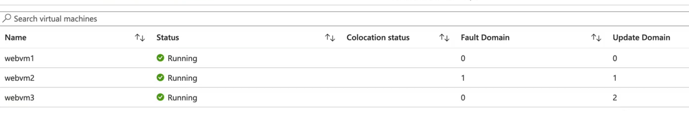
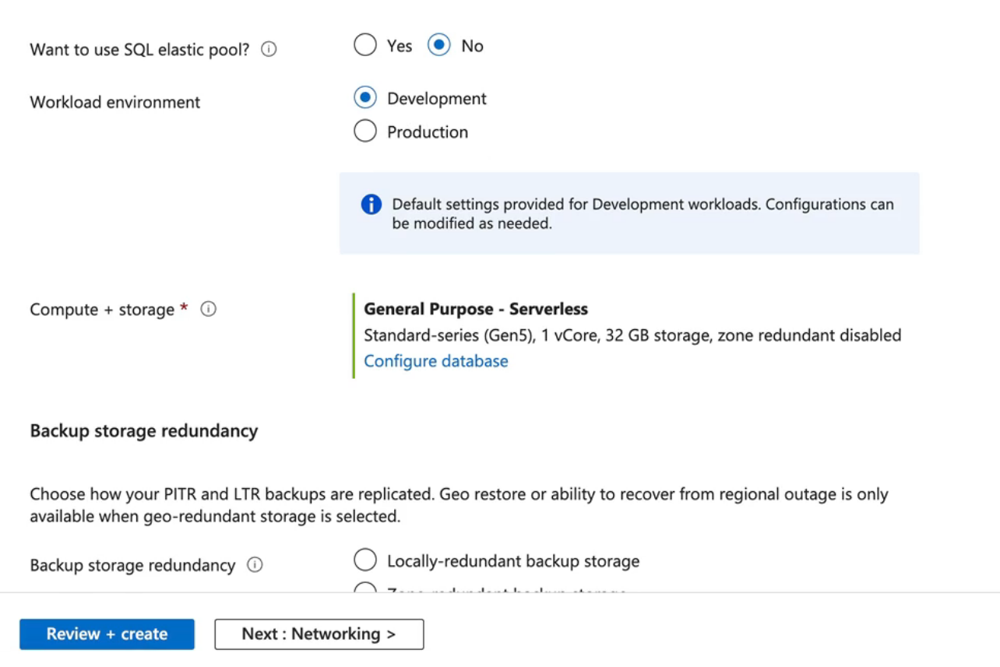
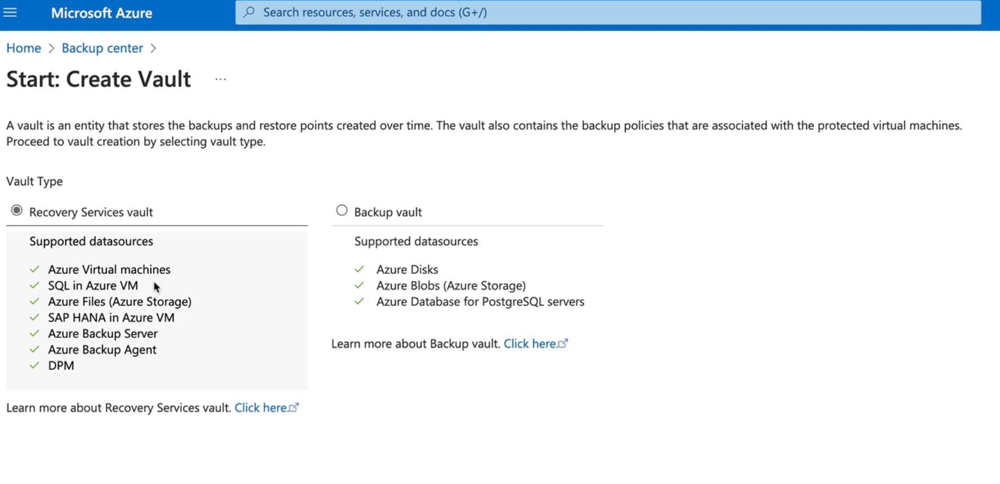
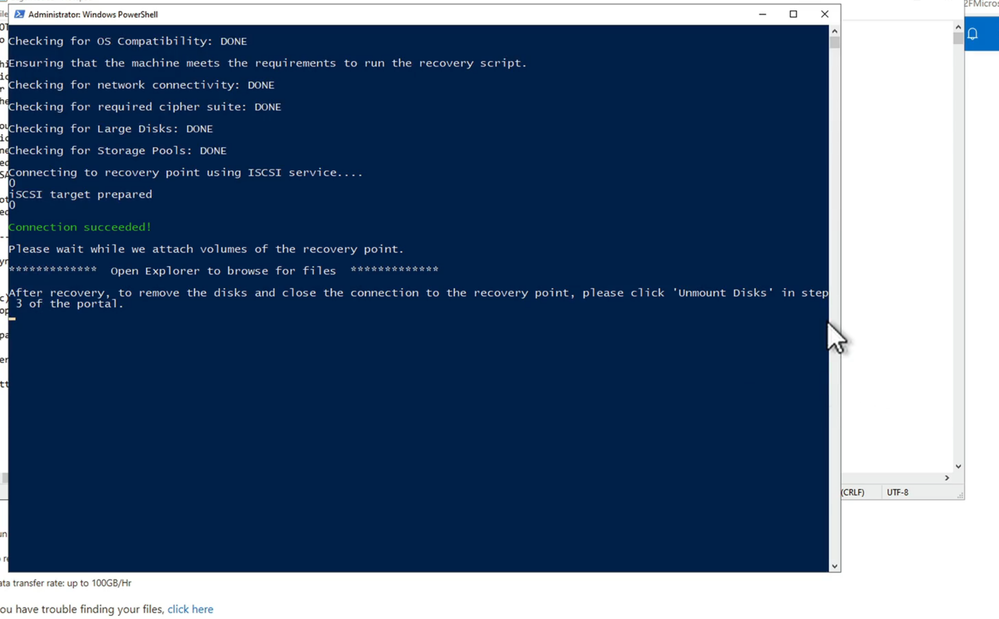

# Overview
---
At this point, 78% complete I suppose. I need to study more on the Analytics platforms section I think. I feel like I have a good grasp on the rest of the content.

# Virtual Machine High Availability
---
Scenario: Users are able to upload some images and have our webapp build things with those images.
We have Azure Infra - Hypervisors and VMs and a tier for image processing - low level latency, high throughput.

What happens if there are failures in Microsoft's Infrastructure?

All of the Web farm might fail or the image processing farm might fail. We need to design for high availability and disaster recovery.

## Solution:
---
- Availabilty sets for VMs - 2 or more VMs in the same availability set, with a load balancer in front of them. This will ensure that if one VM goes down, the other can take over.
- VM Scale Sets might come in handy here.
- Fault Domains - we don't want all our VMs in the same fault domain, as that would mean they would all go down at the same time. We want to spread them across multiple fault domains.
- Update Domains - we want to spread our VMs across multiple update domains, so that when Microsoft performs maintenance, not all our VMs will be updated at the same time.

## Architecture:
---
1. Create your Availability Set first
2. Create your VMs and add them to the Availability Set
3. Create your fault domains and update domains
4. Use Managed Disks for your VMs.
5. Make sure your storage accounts are spread across these.

What about Availability Zone failure?
- We can use proximity placement groups to ensure that our VMs are placed in the same availability zone, so that if one zone goes down, the other can take over.
- You can also specify "Intent" which lets microsoft know what you want to use.

Demo: Configure VM High Availability and Placement Groups
- Create an availability set with 2 fault domains and 2 update domains.
- Create 2 VMs and add them to the availability set.
  
1. Create a proximity placement group
2. Create an availability set and specify the proximity placement group
3. Create VMs and add them to the availability set - the proximity placement group is automatically applied to the VMs in the availability set. :)
4. Create a load balancer and add the VMs to the backend pool of the load balancer.

Note: Some regions have different fault domains and update domains, so you need to check the documentation for the region you are deploying to.

Note: You must match the RG and the availability set.
Note again: you must deallocate all of the VMs to change the proximity placement group of the availability set. This is because the VMs need to be moved to the new proximity placement group, and this can only be done when they are deallocated.

## Azure SQL Database High Availability
---
- Remote Storage Model
- Local Storage Model
- Hyperscale Storage Model

## Remote Storage Model
---
Compute and storage are on two different clusters. The compute cluster is responsible for running the SQL engine, while the storage cluster is responsible for storing the data. This model provides high availability and disaster recovery capabilities, as the compute and storage clusters can be located in different regions.
- backups may be on another cluster.
- may be some failure for heavy workloads
- General Purpose supports Zone Redundancy.

## Local Storage Model
---
- Premium and Business Critical Tiers
In the local storage model, both compute and storage are on the same cluster. This model provides low latency and high throughput, as the compute and storage are located close to each other. However, it may not provide the same level of high availability and disaster recovery capabilities as the remote storage model.
- Everything is local and fast and replicated to an Always ON availability group. This means that if one node goes down, the other can take over with minimal downtime.
- This model is best for workloads that require low latency and high throughput, such as OLTP workloads.
- May be like 4 replicas, all local and available for failover.

## Hyperscale Storage Model
---
The hyperscale storage model is designed for large-scale applications that require massive amounts of storage. This model provides high availability and disaster recovery capabilities, as well as the ability to scale out storage and compute independently.

-This is not available with DTU-based purchasing model, only vCore-based.
- This model is best for workloads that require massive amounts of storage, such as data warehousing and big data analytics workloads.
- Distrinuted, highly available system of four layers: compute, storage, log, data. Each layer can be scaled independently, allowing for high availability and disaster recovery capabilities.
Zone redundancy can be enabled (applied to all layers) to ensure that the database remains available even if an entire availability zone goes down.

# Azure SQL Failover
---
Asyncronous replication to a secondary region, with automatic failover. This is a good option for disaster recovery, as it allows you to have a secondary copy of your database in another region that can take over in case of a failure in the primary region.

Database is replicated to another SQL server and you basically just cutover to the secondary server if the primary server goes down. This can be done manually or automatically, depending on your needs.

## Auto Failover Groups
---
So...Automatically then....
Auto failover groups allow you to automatically failover to a secondary server in case of a failure in the primary server. This is a good option for high availability, as it allows you to have a secondary copy of your database that can take over in case of a failure in the primary server.

This is at the server level, not the database level. You can have multiple databases in the same failover group, but they will all failover together.

You use a failover listener to connect to the primary server, and the listener will automatically redirect traffic to the secondary server in case of a failure in the primary server.

You also use a failover policy to specify the conditions under which the failover should occur, such as the number of seconds to wait before failing over, or the number of failed attempts before failing over. 

Georeplication vs Failover Groups:
  - Georeplication is at the database level, while failover groups are at the server level. 
  - Georeplication allows you to replicate a single database to another region, while failover groups allow you to replicate multiple databases to another region. 
  - Georeplication is a good option for disaster recovery, while failover groups are a good option for high availability. Georeplication is a manual process, while failover groups can be automated. 
  - Georeplication is a good option for smaller databases, while failover groups are a good option for larger databases. 
  - Georeplication is a good option for databases that do not require high availability, while failover groups are a good option for databases that require high availability.
  - Auto failover? Failover groups, failing over multiple databases, failover groups. failover without needing to update the connection string? Failover groups.

# Demo: Configure Active Geo-Replication for Azure SQL
---
1. Create your SQL server and database in the primary region.
2. 
3. Click on Replicas and then click on Add Replica
4. Create a secondary SQL server and database in the secondary region.
5. Configure active geo-replication by linking the primary database to the secondary database.
6. Not that one of them is readable and not the other. The primary database is read/write, while the secondary database is read-only.
7. Check the connection strings and you will notice that you need to update the connection string to point to the secondary database in case of a failover. This is where failover groups come in handy, as they allow you to use a single connection string that automatically redirects to the secondary database in case of a failover.

# Demo: Configure Auto Failover Groups for Azure SQL
---
1. Create your SQL server and database in the primary region.
2. Click on Failover groups and then click on Add group - at the SERVER level :)
3. Create a secondary SQL server and database in the secondary region.
4. Configure auto failover by linking the primary server to the secondary server and specifying the databases that you want to include in the failover group.
5. Configure the failover policy to specify the conditions under which the failover should occur, such as the number of seconds to wait before failing over, or the number of failed attempts before failing over.
6. Check the connection strings and you will notice that you can use the same connection string for both the primary and secondary databases, as the failover group will automatically redirect to the secondary database in case of a failover.
Note: The read/write listener endpoint will remain the same, but the read-only endpoint will change to point to the secondary database in case of a failover. This allows you to use the same connection string for both the primary and secondary databases, as the failover group will automatically redirect to the secondary database in case of a failover.

# Azure Backup Overview
---
Azure Backup is a cloud-based backup solution that provides reliable and cost-effective data protection for Azure resources. It allows you to back up and restore data from Azure virtual machines, Azure SQL databases, Azure Files, and on-premises servers. Azure Backup provides a simple and secure way to protect your data against accidental deletion, corruption, or disasters. Azure Backup uses a combination of incremental backups, compression, and encryption to optimize storage and ensure data security. It also provides features such as backup scheduling, retention policies, and monitoring to help you manage your backups effectively. With Azure Backup, you can easily restore your data to a specific point in time, ensuring that you can recover from any data loss or corruption quickly and efficiently.

Lets say you have some Azure resources or on premises server that users are accessing data from. 
You can back all of this up to Azure Backup.

- Application Consistent Backups: All the data in memory is written to disk before the backup is taken, ensuring that the backup is consistent and can be used for recovery.
- Incremental Backups: Only the changes made since the last backup are captured, reducing storage costs and backup time.
- Long-term Retention: You can specify how long you want to retain your backups, allowing you to meet compliance requirements and ensure that you have access to historical data when needed.
- Compatibility - Windows, Linux, SQL, SAP, PostgreSQL, MySQL, VMWare, Hyper-V.

## Components of Azure Backup
---
Backup Center: The central management interface for Azure Backup, where you can manage your backup policies, monitor backup jobs, and view backup reports.
Vaults: A vault is a storage entity in Azure that is used to store backup data. It provides a secure and scalable storage solution for your backups.
- Recovery Services Vault: Used for backing up Azure virtual machines, on-premises servers, and other Azure resources.
- Backup Vault: Used for backing up Azure SQL databases and Azure Files.
Backup Policies: A backup policy defines the schedule and retention settings for your backups. It specifies when backups are taken, how long they are retained, and how many recovery points are kept.
- You can create backup policies that specify the frequency of backups (e.g., daily, weekly, monthly) and the retention period for each backup (e.g., 30 days, 90 days, 1 year).
- You can also specify the number of recovery points to keep, which determines how many previous versions of your data are available for recovery.
Backup Items: A backup item is an individual resource that is being backed up. It can be a virtual machine, a database, or a file share. Each backup item is associated with a backup policy that defines the schedule and retention settings for that item.
Snapshots: VMs and Disks can be backed up using snapshots, which are point-in-time copies of the data. Snapshots can be used for quick recovery or for creating new VMs from existing ones.
Crash Consistent Backups: For applications that require a consistent state, such as databases, Azure Backup can take crash-consistent backups. This ensures that the backup captures the state of the application at the time of the backup, allowing for reliable recovery.

NOTE: The type of vault depends on the type of resource you want to back up. For example, if you want to back up Azure virtual machines, you would use a Recovery Services Vault. If you want to back up Azure SQL databases, you would use a Backup Vault.

Agents vs Managed Identities:
- Agents are software components that are installed on the resource being backed up. They are responsible for communicating with the Azure Backup service and performing the backup operations. Agents are typically used for on-premises servers and virtual machines that are not running in Azure.
- Managed Identities are a feature of Azure Active Directory that allows Azure resources to authenticate to Azure services without the need for credentials. Managed Identities are typically used for Azure resources that are running in Azure, such as virtual machines and Azure SQL databases. They provide a more secure and scalable way to authenticate to Azure services, as they eliminate the need for storing and managing credentials.

Managed Identity: PostgreSQL, Blobs, Disks
Agents: VMs
Need to register file shares and SQL databases with the vault to be able to back them up.

# Demo: Manage Azure Backups for VMs
---
1. Navigate to Azure Backup Center
2. Create a Recovery Services Vault

3. Create a backup policy that specifies the schedule and retention settings for your backups.
4. Register your virtual machines with the vault and associate them with the backup policy.
5. Monitor your backup jobs and view backup reports to ensure that your backups are running successfully and that you have the necessary recovery points available for your resources.
Note: One VM, one Vault, one region. You can have multiple VMs in the same vault, but they must be in the same region. You can have multiple vaults in different regions to back up VMs in those regions.

Restore:
1. Navigate to the Recovery Services Vault where your backup is stored.
2. Click on the "Backup Items" blade and select the virtual machine you want to restore.
3. Click on the "Restore" button and select the restore point you want to use for the restore operation.
4. Follow the prompts to specify the restore settings, such as the target resource group, virtual machine name, and network settings.
5. Click on the "Restore" button to start the restore operation. The restore process can create a new virtual machine or restore disks (to mount someplace) based on the selected restore point, and it will be deployed to the specified resource group and network settings. Once the restore operation is complete, you can access the restored virtual machine and verify that it is functioning correctly. You can also monitor the restore operation in the Azure Backup Center to track its progress and ensure that it completes successfully.

Note: YOU CAN REPLACE THE ORIGINAL VM WITH THE RESTORE POINT, OR YOU CAN CREATE A NEW VM FROM THE RESTORE POINT. This allows you to test the restore process without affecting the original VM, or to quickly recover from a failure by replacing the original VM with the restored version.   B. Careful. You can also restore to a different region if needed, but this may require additional configuration and may incur additional costs.

File recovery option: You can also restore individual files from a backup, rather than restoring the entire virtual machine. This can be useful if you only need to recover specific files or folders, rather than the entire VM. To do this, you can use the Azure Backup Explorer tool, which allows you to browse the contents of your backups and select specific files or folders to restore. This can help you quickly recover important data without having to restore the entire VM, saving time and resources.

# Azure Site Recovery Overview
---
Azure Site Recovery is a disaster recovery solution that allows you to replicate and failover your applications and workloads to Azure in the event of a disaster. It provides a simple and cost-effective way to ensure business continuity and minimize downtime in case of a disaster. Azure Site Recovery supports a wide range of applications and workloads, including virtual machines, physical servers, and applications running on-premises or in the cloud. It provides features such as replication, failover, and failback to help you quickly recover your applications and workloads in the event of a disaster. With Azure Site Recovery, you can ensure that your applications and workloads are always available, even in the face of unexpected events or disasters.

